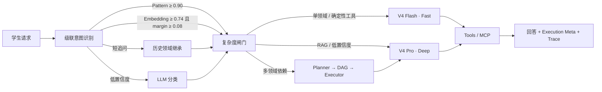
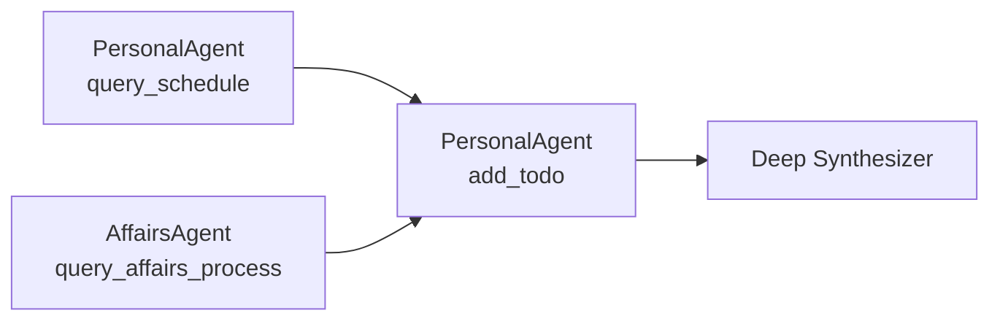

# EchoGuide · 西电校园智慧助手

EchoGuide 是面向西安电子科技大学学生的校园 Agent，也是一个可观测、可评测的 Agent Runtime。它不把所有请求都送进同一条昂贵链路：课表、校车、办事清单和故障诊断走 **DeepSeek V4 Flash 快速路径**；政策检索、低置信度问题和跨领域依赖任务进入 **DeepSeek V4 Pro 深度路径**。

项目保留多 Agent、四层分层记忆（L0-L3 金字塔 + 上下文卸载）、Agentic RAG、动态 Skills、MCP、语义缓存、Guard、Trace、Monitor 与 LLM-as-Judge，但每项技术都有明确触发条件和可复现实测，而不是停留在架构图中。

## 三类核心任务

| 任务 | 示例 | 系统行为 |
|---|---|---|
| 个人校园状态 | “我今天有什么课？”“还有哪些 DDL？” | 读取登录用户的课表、待办与考试数据 |
| 确定性校园服务 | “算一下加权成绩”“校园卡怎么补办”“校园网认证后打不开网页” | 调用领域专属工具，返回可测试的结构化结果 |
| 复杂校园任务 | “明天下午有空就安排我去补办校园卡，并记个待办” | Planner 生成依赖 DAG，多个 Agent 分波执行并合成结果 |

## 真实网页实测

以下截图由 Playwright 访问真实网页、登录 Demo 用户、导入动态课表、调用真实 DeepSeek 模型后自动生成；使用 `?debug=1` 展开 Profile、分类阶段、工具、DAG、Token 和 Trace ID。

### Fast · 个人课表


### 领域专属工具


### Deep · Agentic RAG


### 多 Agent 依赖 DAG


### 多轮记忆与 Guard 拒绝


## Fast / Deep 双路径



| Profile | 模型 | 思考模式 | 输出预算 | RAG 策略 | 典型任务 |
|---|---|---|---:|---|---|
| Fast | `deepseek-v4-flash` | 关闭 | 768 | Top-K 3，不改写、不重排 | 课表、天气、校车、确定性工具 |
| Deep | `deepseek-v4-pro` | 开启，effort=high | 1536 | Top-K 5，查询改写 + 本地 bge 重排（LLM 兜底） | 政策问答、复杂请求、多 Agent |

Monitor 按 `academic.fast`、`academic.deep` 等真实 Profile 统计成功率、延迟和在途请求。Fast 执行失败时升级到 Deep；两种 Profile 可以分别配置 API Key、模型和端点。

> 图中 Embedding 阈值 0.74 / margin 0.08 为默认值，可通过 `ECHOGUIDE_INTENT_EMBEDDING_THRESHOLD` / `_MARGIN` 覆盖（见下文「本地向量模型」）。

## 本地向量模型（Embedding / Rerank）

检索链路不再依赖 ChromaDB 内置的英文模型和 LLM 打分重排，改为**进程内 ONNX 轻量推理**（无 torch，CPU 毫秒级）：

| 环节 | 模型 | 规模 | 说明 |
|---|---|---|---|
| Embedding | `bge-small-zh-v1.5`（[ONNX 导出](https://huggingface.co/onnx-community/bge-small-zh-v1.5-ONNX)） | 24M 参数 · 512 维 · ~95MB | 中文优化，替代 all-MiniLM-L6-v2（英文模型，中文语义弱） |
| Rerank | `bge-reranker-base`（[ONNX 导出](https://huggingface.co/Xenova/bge-reranker-base)） | 280M 参数 · fp16 ~570MB | cross-encoder 本地重排，替代 LLM 打分（秒级 → 毫秒级，零 token 成本） |

设计要点：

- **统一入口 `mcp/embeddings.py`**：懒加载单例 + 5 分钟失败冷却自动重试；模型经 `ECHOGUIDE_MODEL_CACHE_DIR` 缓存（Docker 镜像构建时预下载，运行期优先读缓存，支持 `HF_ENDPOINT` 镜像）。
- **全链路降级**：模型不可用时 Embedding 回退 ChromaDB 内置 MiniLM、Rerank 回退 LLM 打分、意图识别回退 n-gram —— collection 名随向量空间切换（`knowledge_base_v3` 等），两种模型的向量**绝不混存**，旧空间数据自动重嵌入迁移。
- **bge-zh 指令前缀**只加在 query 侧（`embed_query`）；chromadb 0.5.x 无法区分 query/document，collection 路径默认不加前缀（`ECHOGUIDE_EMBED_PREFIX_MODE=both` 可切换）。
- **阈值可配**：`ECHOGUIDE_INTENT_EMBEDDING_THRESHOLD` / `_MARGIN` 覆盖意图识别 Embedding 决策阈值（默认 0.74/0.08 按旧模型分数分布标定，切换 bge 后建议重标定，见下）。

量化收益（在模型缓存/联网环境运行）：

```bash
python evaluation/compare_embedders.py             # 旧 MiniLM vs 新 bge：HitRate@K / Recall@K / MRR
python evaluation/calibrate_intent_thresholds.py   # 按 bge 分数分布重标定意图识别阈值
```

## 多 Agent 的合理触发边界

简单问题始终走单 Agent。只有两类请求进入协作：

- `parallel`：显式包含“同时、还要、并且、另外、顺便”等复合语义，并命中两个以上领域。
- `dependent`：命中必须使用前序结果的任务规则。

依赖任务示例：



Executor 每次最多运行三个 Agent、六个任务；依赖缺失或出现循环时直接失败并记录计划错误，不会绕过 DAG 执行。

## 五个 Agent 与真实能力差异

| Agent | 专属能力 | 工具权限 |
|---|---|---|
| AcademicAgent | 学业政策 RAG、加权学分成绩计算 | `knowledge_search`、`calculate_weighted_score` |
| AffairsAgent | 版本化办事材料、步骤、部门与来源 | `knowledge_search`、`query_affairs_process` |
| ITHelpAgent | 校园网、VPN、统一认证、教务系统诊断树 | `knowledge_search`、`diagnose_it_issue` |
| CampusLifeAgent | 校车、楼宇、场馆、图书馆、天气 | `knowledge_search`、`query_campus_info`、`get_weather` |
| PersonalAgent | 登录用户课表、待办、DDL 与考试 | `query_schedule`、`query_todo`、`add_todo`、`complete_todo`、`query_ddl` |

工具在模型可见范围和执行层分别校验权限。个人工具只接受服务端签名 Cookie 中的身份，客户端提交的 `user_id` 不作为可信身份。

## 意图 Action 与执行策略

路由只看领域（domain = 谁处理）；动作（action = 怎么处理）控制同一 Agent 的执行策略：

| action | 工具权限 | Prompt 行为指引 |
|---|---|---|
| `query` | 只读/查询类工具（禁止状态修改类） | 准确查询、如实回答，不执行修改操作 |
| `request` | 完整工具（含执行类） | 积极调用工具解决问题，按需执行操作 |
| `complaint` | 只读工具（保守） | 先识别具体问题点，再给出解决路径 |
| `greeting` / `feedback` | 原则上不开放工具 | 简洁回应，避免无意义工具调用 |
| `other` | 只读工具（保守） | 仅基于已有信息回答，不执行修改操作 |

状态修改类工具登记于 `WRITE_TOOLS`（新增写工具必须登记，否则只读动作下会被误开放），过滤在工具暴露层、执行层与协作补执行三处同时生效。

## 真实 Benchmark

Benchmark 使用 12 个版本化场景，覆盖五个领域、追问继承、Fast/Deep 路由、专属工具、RAG、多 Agent DAG 和 Guard。默认每个场景运行三次，并与 Always-LLM + Always-Deep 基线比较。

<!-- BENCHMARK:START -->
> 实测时间：2026-08-09 16:56:50 +0800 · Commit `a85c806` · 每场景重复 3 次

| 指标 | 自适应链路 | Always-LLM + Always-Deep 基线 |
|---|---:|---:|
| 用例通过率 | 100.0% | 63.6% |
| 领域准确率 | 100.0% | 81.8% |
| 领域 Macro-F1 | 100.0% | 73.3% |
| LLM 分类调用率 | 9.1% | 100.0% |
| Profile 路由准确率 | 100.0% | 81.8% |
| 复杂度 Precision / Recall | 100.0% / 100.0% | 100.0% / 100.0% |
| 专属工具成功率 | 100.0% | 66.7% |
| DAG 任务成功率 | 100.0% | 100.0% |
| RAG HitRate@5 / Recall@5 / MRR | 100.0% / 100.0% / 1.00 | — |
| 引用正确率 | 100.0% | 100.0% |
| P50 延迟 | 4641 ms | 6700 ms |
| P95 延迟 | 55040 ms | 47198 ms |
| 输入 / 输出 Token | 84501 / 30436 | 81476 / 28917 |

> 消融：专属工具成功率 100.0%，改用通用 RAG 后为 0.0%；依赖 DAG 成功率 100.0%，强制单 Agent 后为 0.0%。
<!-- BENCHMARK:END -->

完整机器可读结果保存在 [`assets/readme/demo-metrics.json`](assets/readme/demo-metrics.json)。报告记录时间、Git commit、模型、逐场景检查和失败信息，不隐藏不利结果。

## 分层记忆：L0-L3 金字塔 + 上下文卸载

记忆按抽象层级组织（对应 [TencentDB-Agent-Memory](https://github.com/Tencent/TencentDB-Agent-Memory) 语义金字塔思路的轻量实现）：低层保留证据、高层保留结构，任何高层结论可沿证据链逐层下钻回原始对话。

| 层级 | 内容 | 存储 | 写入时机 |
|---|---|---|---|
| L3 Persona | 长期画像，版本历史可回滚 | ChromaDB + SQLite | 检测到背景/偏好信号时 LLM 提炼 |
| L2 Scenario | 场景块（任务/结论/关键实体） | ChromaDB `layer=scenario` | 工作记忆压缩时生成，检索优先注入 |
| L1 Atom | 结构化原子事实，带证据链 | SQLite `facts` | 与画像提炼同一次 LLM 调用双产出 |
| L0 Raw | 原始对话全量，永不丢失 | SQLite `raw_messages` | 每条消息落库，`turn_id` 为证据锚点 |

设计要点：

- **一次提炼双产出**：画像信号触发时，一次 LLM 调用同时产出画像（L3）与原子事实（L1），零额外成本；事实带 `source_conv/source_turn` 证据链，可下钻到 L0 原文。
- **白盒可溯源**：高层结论 → 事实 → 原文逐层可查；`memory_trace` 把各层命中统计透出到 `execution`（debug 面板可见）。
- **上下文卸载**：工具结果超过 1500 字符时完整落盘 refs 表，上下文只留摘要 + `refs/{id}` 索引，需要时 100% 找回 —— 长任务 Token 消耗显著下降。
- **治理**：画像版本化可回滚；事实失效标记（不物理删除）；`prune` 生命周期清理（原文 TTL / 失效事实 / 版本上限）。

确定性离线评测（模拟数据、无 API 依赖、可重复、可入 CI）：

```bash
python evaluation/memory_benchmark.py
```

| 指标 | 结果 |
|---|---:|
| 上下文卸载（3 个长工具结果） | 9267 tokens → 591 tokens（节省 93.6%） |
| L0 原文保留 | 100%（12 轮全量落库） |
| L1 事实证据链溯源 | 100%（每条可下钻到 L0 原文） |
| refs 卸载找回 | 100%（完整结果可恢复） |
| L3 画像版本回滚 | OK（3 版可回滚到最老版） |
| 画像提炼触发 | 仅信号句触发 LLM（模拟对话信号率 50%，普通提问不提炼） |

> Token 估算口径：中文 1 字符 ≈ 1 token、ASCII 4 字符 ≈ 1 token（相对对比用，实际消耗以模型 API usage 为准）。

## Agent 工程闭环

- **四层记忆金字塔（L0-L3）**：SQLite 原文层全量保留原始对话（证据链锚点）；原子事实层存结构化事实（带来源会话与轮次，可下钻溯源）；场景层在压缩时生成"场景块"并优先注入跨会话上下文；画像层版本化可回滚。工作记忆仍由 Redis 承担，超过阈值时 LLM 场景化压缩。
- **上下文卸载**：工具调用大结果落盘 refs 表，上下文只留摘要行 + `refs/{id}` 索引（可 100% 找回），长任务 Token 显著下降。
- **Agentic RAG**：Deep Profile 自主调用知识检索，执行查询改写、并行召回、去重与重排；Embedding 用本地 bge-small-zh-v1.5（中文优化），重排用 bge-reranker-base 本地打分（LLM 兜底）；回答携带来源证据。
- **知识库导入**：`/knowledge/upload` 与 `data/knowledge_docs/` 投放目录支持 txt/md/json/pdf/docx；PDF 逐页提取并给分块标注页码，Word 按文档流保留段落与表格；分块采用 LangChain 递归分隔符思路（段落 → 句子 → 逗号 → 字符），500 字/60 overlap，超长句子逐级拆开不撑爆单块；扫描件（无文本层 PDF）明确报错，不做 OCR。
- **动态 Skills**：五类校园 SOP 可热加载，按 Agent、关键词和对话历史注入 Prompt。
- **双层语义缓存**：先按上下文依赖性判定缓存策略——公共事实查询进 Global 语义匹配；依赖用户画像的问题按 user_id 分区进 User 层；追问/省略句/指代等强上下文依赖请求直接 bypass 语义缓存。个人数据领域不缓存。
- **EchoGuide Guard**：Prompt 注入检测、输入限制、用户/IP 限流、审计脱敏与失败关闭。
- **可观测性**：SSE 展示工具过程；`execution` 返回安全执行摘要；Trace 记录逐跳耗时；Prometheus 采集真实成功率/延迟指标，`config/alerts/` 提供告警规则，Monitor 反馈到 Profile 路由。
- **评测**：意图 Accuracy/Macro-F1、RAG HitRate/Recall/MRR、引用正确率、回答忠实性、回归基线和双模型 Judge。
- **MCP**：`POST /mcp` 提供 Streamable HTTP tools 子集。浏览器与 MCP 均使用签名登录 Cookie；未登录客户端只能调用公开工具。

## 快速启动

### 1. 配置

```powershell
Copy-Item .env.example .env
# 编辑 .env，填写 ANTHROPIC_API_KEY
# 本地向量模型（bge Embedding / Rerank）首次运行自动下载到
# ECHOGUIDE_MODEL_CACHE_DIR（Docker 镜像构建时已预下载，无需手动操作）
```

生产环境（`APP_ENV=production`）**必须设置 `JWT_SECRET_KEY`**（会话签名密钥），
缺失或保持占位值时服务将拒绝启动（fail-closed）。首次启动可用
`ECHOGUIDE_ADMIN_PASSWORD` 播种管理员账号（仅对新建数据库生效）。

默认 DeepSeek 配置：

```dotenv
ANTHROPIC_BASE_URL=https://api.deepseek.com/anthropic
ANTHROPIC_MODEL=deepseek-v4-flash
ECHOGUIDE_FAST_MODEL=deepseek-v4-flash
ECHOGUIDE_DEEP_MODEL=deepseek-v4-pro
```

### 2. 本地运行

```powershell
pip install -r requirements.txt -r requirements-dev.txt
python -m uvicorn api.main:app --port 8000
```

另一个终端：

```powershell
Set-Location frontend
npm install
npm run dev
```

Vite 开发代理默认转发到 `http://localhost:8000`（与上方 uvicorn 端口一致）；
Docker 部署时后端对外端口为 8100，可用 `VITE_PYTHON_API_URL=http://localhost:8100` 覆盖。

访问 `http://localhost:5175`；技术演示模式为 `http://localhost:5175/?debug=1`。

### 3. Docker Compose

```powershell
docker compose up -d --build
```

统一入口为 `http://localhost:8088`，API 文档为 `http://localhost:8088/api/docs`。

## 复现 Demo、指标与截图

本地 Benchmark 策略覆盖默认关闭。仅在演示环境设置：

```dotenv
ECHOGUIDE_BENCHMARK_ENABLED=1
```

运行 Smoke：

```powershell
python -m evaluation.demo_benchmark --base-url http://localhost:8000 --smoke
```

运行完整三轮真实 Benchmark 并更新 README：

```powershell
python -m evaluation.demo_benchmark --base-url http://localhost:8000 --repeat 3 --update-readme
```

安装浏览器并生成五张真实网页截图：

```powershell
Set-Location frontend
npx playwright install chromium
$env:ECHOGUIDE_DEMO_URL='http://localhost:8088'
npm run demo:capture
```

脚本默认驱动系统 Microsoft Edge；可用 `ECHOGUIDE_PLAYWRIGHT_CHANNEL=chrome` 切换到 Chrome。本地 Vite 模式可额外设置 `ECHOGUIDE_API_URL=http://127.0.0.1:8100`。

截图脚本会自动登录专用 `echoguide_demo` 用户、替换该用户课表并实测 SSE；不会修改其他用户数据。回答失败、执行路径不符或截图缺失时命令返回非零。

## API 摘要

| 方法 | 路径 | 说明 |
|---|---|---|
| POST | `/chat`、`/chat/stream` | 对话与 SSE；附加向后兼容的 `execution` 字段 |
| POST/GET | `/personal/schedule/*`、`/personal/todo/*` | 登录用户课表、待办、DDL |
| POST | `/mcp` | MCP Streamable HTTP tools 子集 |
| POST | `/search` | RAG 改写、召回、重排演示 |
| POST/GET | `/knowledge/*` | 管理员知识导入与统计 |
| GET | `/monitor`、`/metrics`、`/traces` | 监控、Prometheus 和 Trace |
| POST | `/eval/run` | 管理员评测入口 |

`execution` 只包含路径、Profile、分类阶段、Agent、工具名、任务状态、模型、Token 和 Trace ID；不会返回思维链、完整 Prompt、个人上下文或敏感工具参数。

## 测试

```powershell
python -m pytest tests -q
Set-Location frontend
npm run build
npm audit --omit=dev --audit-level=high
```

CI 运行全部离线回归、前端构建、依赖审计和 Docker Compose 配置检查。真实 DeepSeek Benchmark 与截图任务由开发者手动触发，避免 CI 消耗密钥。

## 项目结构

```text
agents/        Fast/Deep 五领域 Agent、复杂度闸门、Planner/DAG/Executor/Synthesizer
api/           FastAPI、认证、SSE、execution 元数据、MCP 与管理接口
core/          级联意图识别、领域词表、Skills 与 Trace
tools/         个人、校园、Academic、Affairs、IT 确定性工具
data/public/   版本化校园公开信息、办事流程和 IT 诊断树
memory/        分层记忆（L0 原文 / L1 事实 / L2 场景 / L3 画像历史）与工作记忆
mcp/           工具管理器、Agentic RAG、协议和语义缓存
config/        Prometheus 抓取配置与告警规则（config/alerts/）
evaluation/    离线评测与真实 Demo Benchmark
frontend/      Vue 3 学生界面、debug 执行详情和 Playwright 截图
assets/readme/ README 截图与真实 Benchmark 结果
```

> 仓库内结构化校园信息包含来源、更新时间和适用范围；无法确认的内容会明确标为演示级数据。实际办理、班次和开放时间应以学校最新官方通知为准。
