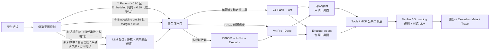
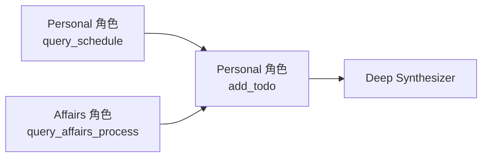

# EchoGuide · 西电校园智慧助手

EchoGuide 是面向西安电子科技大学学生的校园 Agent，也是一个可观测、可评测的 Agent Runtime。它不把所有请求都送进同一条昂贵链路：课表、校车、办事清单和故障诊断走 **DeepSeek V4 Flash 快速路径**；政策检索、低置信度问题和跨领域依赖任务进入 **DeepSeek V4 Pro 深度路径**。

项目保留按需多 Agent 协作、四层分层记忆（L0-L3 金字塔 + 上下文卸载）、Agentic RAG、动态 Skills、MCP、语义缓存、Guard、Trace、Monitor、出口校验与 LLM-as-Judge，但每项技术都有明确触发条件和可复现实测，而不是停留在架构图中。

## 三类核心任务

| 任务 | 示例 | 系统行为 |
|---|---|---|
| 个人校园状态 | “我今天有什么课？”“还有哪些 DDL？” | 读取登录用户的课表、待办与考试数据 |
| 确定性校园服务 | “算一下加权成绩”“校园卡怎么补办”“校园网认证后打不开网页” | 调用领域专属工具，返回可测试的结构化结果 |
| 复杂校园任务 | “明天下午有空就安排我去补办校园卡，并记个待办” | Planner 生成依赖 DAG，QA/Executor 职责角色按任务分波执行并合成结果 |

## 真实网页实测

以下截图由 Playwright 访问真实网页、登录 Demo 用户、导入动态课表、调用真实 DeepSeek 模型后自动生成；使用 `?debug=1` 展开 Profile、分类阶段、工具、DAG、Token 和 Trace ID。

### Fast · 个人课表


### 领域专属工具


### Deep · Agentic RAG


### 多 Agent 依赖 DAG


### 多轮记忆与 Guard 拒绝


## Fast / Deep 双路径



| Profile | 模型 | 思考模式 | 输出预算 | RAG 策略 | 典型任务 |
|---|---|---|---:|---|---|
| Fast | `deepseek-v4-flash` | 关闭 | 768 | Top-K 3，不改写、不重排 | 课表、天气、校车、确定性工具 |
| Deep | `deepseek-v4-pro` | 开启，effort=high | 1536 | Top-K 5，查询改写 + 本地 bge 重排（LLM 兜底） | 政策问答、复杂请求、多 Agent |

Monitor 按 `qa.fast`、`executor.deep` 等职责角色 × Profile 统计成功率、延迟和在途请求。Fast 执行失败时升级到 Deep；两种 Profile 可以分别配置 API Key、模型和端点。

> 图中 Pattern 阈值 0.90、Embedding 阈值 0.80 / margin 0.10 为默认值（按真实 bge 分布标定：同构嵌入下命中区与 miss 区存在分离空档；宁紧勿松，有 LLM 兜底），可通过 `ECHOGUIDE_INTENT_PATTERN_THRESHOLD` / `ECHOGUIDE_INTENT_EMBEDDING_THRESHOLD` / `_MARGIN` 覆盖（见下文「本地向量模型」）。

## 本地向量模型（Embedding / Rerank）

检索链路不再依赖 ChromaDB 内置的英文模型和 LLM 打分重排，改为**进程内 ONNX 轻量推理**（无 torch，CPU 毫秒级）：

| 环节 | 模型 | 规模 | 说明 |
|---|---|---|---|
| Embedding | `bge-small-zh-v1.5`（[ONNX 导出](https://huggingface.co/onnx-community/bge-small-zh-v1.5-ONNX)） | 24M 参数 · 512 维 · ~95MB | 中文优化，替代 all-MiniLM-L6-v2（英文模型，中文语义弱） |
| Rerank | `bge-reranker-base`（[ONNX 导出](https://huggingface.co/Xenova/bge-reranker-base)） | 280M 参数 · fp16 ~570MB | cross-encoder 本地重排，替代 LLM 打分（秒级 → 毫秒级，零 token 成本） |

设计要点：

- **统一入口 `mcp/embeddings.py`**：懒加载单例 + 5 分钟失败冷却自动重试；模型经 `ECHOGUIDE_MODEL_CACHE_DIR` 缓存（Docker 镜像构建时预下载，运行期优先读缓存，支持 `HF_ENDPOINT` 镜像）。
- **全链路降级**：模型不可用时 Embedding 回退 ChromaDB 内置 MiniLM、Rerank 回退 LLM 打分、意图识别回退 n-gram —— collection 名随向量空间切换（`knowledge_base_v3` 等），两种模型的向量**绝不混存**，旧空间数据自动重嵌入迁移。
- **bge-zh 指令前缀**只加在 query 侧（`embed_query`）；chromadb 0.5.x 无法区分 query/document，collection 路径默认不加前缀（`ECHOGUIDE_EMBED_PREFIX_MODE=both` 可切换）。
- **阈值可配**：`ECHOGUIDE_INTENT_EMBEDDING_THRESHOLD` / `_MARGIN` 覆盖意图识别 Embedding 决策阈值（默认 0.80/0.10，按真实 bge 分数分布标定；模板匹配为同构嵌入——bge-zh 指令前缀只用于 RAG 检索，见下）。

量化收益（在模型缓存/联网环境运行）：

```bash
python evaluation/compare_embedders.py             # 旧 MiniLM vs 新 bge：HitRate@K / Recall@K / MRR
python evaluation/calibrate_intent_thresholds.py   # 按 bge 分数分布重标定意图识别阈值
```

## 职责角色与按需多 Agent 协作

执行实体按**职责**拆分（领域不再构成 Agent，只做人格/Skills 挂载键）：

| 职责角色 | 工具面 | 行为规范 | 选择时机 |
|---|---|---|---|
| **QA Agent**（问答） | 公共工具层 − 写工具（角色级只读边界） | 政策先检索、回答带引用、不编造 | 除 REQUEST 外的所有动作 |
| **Executor Agent**（执行） | 公共工具层全量（含写） | 写操作回执、失败如实说明 | `request` 动作 |

写权限双层门禁：角色级（QA 永远调不动写工具）+ Action 级（QUERY/GREETING 等动作拒写）。

协作只进入两类请求：

- `parallel`：显式包含“同时、还要、并且、另外、顺便”等复合语义，并命中两个以上领域。
- `dependent`：命中必须使用前序结果的任务规则。

依赖任务示例（任务角色标签沿用领域值，执行实体为 QA/Executor）：



DAG 每个任务是独立上下文的执行实体，依赖缺失或出现循环时直接失败并记录计划错误，不会绕过 DAG 执行。

## 领域挂载（顾问，不是门卫）

v4：LLM 意图识别不再输出领域——领域只由**免费关键词路径**（消息命中 → 历史回溯）产出，用于人格挂载与观测。所有工具进入公共工具层（不按领域剪裁），执行实体只有 QA/Executor 两个职责角色：

| 领域（免费关键词产出） | 挂载的人格要点 | 挂载的 Skills |
|---|---|---|
| academic | 教务规则、先检索再回答、来源链接与适用范围 | `skills/academic/` |
| campus_life | 位置/时段、天气先调工具、短追问继承 | `skills/campus_life/` |
| affairs | 办事流程/材料/入口为主，以最新通知为准 | `skills/affairs/` |
| it_help | 诊断树优先、步骤化排障、引导联系信息化处 | `skills/it_help/` |
| personal | 数据只来自工具、按时间组织、引导导入课表 | `skills/personal/` |
| other | 通用接待（GitHub 等外部问题不再由学业人格兜底） | — |

个人工具（课表/待办）的约束是**数据归属 + 写门禁**（user_id 由服务端签名 Cookie 注入，客户端提交的 `user_id` 不作为可信身份；写操作受角色级 + Action 级双重门禁），与领域无关——这正是"GitHub 挂哪个领域"问题的结构性答案：工具只声明读写属性，不选领域。

## 意图 Action 与执行策略

意图识别产出「领域 × 动作」：domain 只挂载人格/Skills（顾问），action 决定职责角色（REQUEST→Executor，其余→QA）与执行策略：

| action | 工具权限 | Prompt 行为指引 |
|---|---|---|
| `query` | 只读/查询类工具（禁止状态修改类） | 准确查询、如实回答，不执行修改操作 |
| `request` | 完整工具（含执行类） | 积极调用工具解决问题，按需执行操作 |
| `complaint` | 只读工具（保守） | 先识别具体问题点，再给出解决路径 |
| `greeting` / `feedback` | 原则上不开放工具 | 简洁回应，避免无意义工具调用 |
| `other` | 只读工具（保守） | 仅基于已有信息回答，不执行修改操作 |

状态修改类工具登记于 `WRITE_TOOLS`（新增写工具必须登记，否则只读动作下会被误开放），过滤在角色级（QA 永不暴露/执行）、Action 级（QUERY 等动作拒写）与协作补执行三处同时生效。

## 真实 Benchmark

Benchmark 使用 12 个版本化场景，覆盖五个领域、上下文追问（LLM 结合历史分类）、Fast/Deep 路由、专属工具、RAG、多 Agent DAG 和 Guard。默认每个场景运行三次，并与 Always-LLM + Always-Deep 基线比较。

<!-- BENCHMARK:START -->
> 实测时间：2026-08-09 16:56:50 +0800 · Commit `a85c806` · 每场景重复 3 次

| 指标 | 自适应链路 | Always-LLM + Always-Deep 基线 |
|---|---:|---:|
| 用例通过率 | 100.0% | 63.6% |
| 领域准确率 | 100.0% | 81.8% |
| 领域 Macro-F1 | 100.0% | 73.3% |
| LLM 分类调用率 | 9.1% | 100.0% |
| Profile 路由准确率 | 100.0% | 81.8% |
| 复杂度 Precision / Recall | 100.0% / 100.0% | 100.0% / 100.0% |
| 专属工具成功率 | 100.0% | 66.7% |
| DAG 任务成功率 | 100.0% | 100.0% |
| RAG HitRate@5 / Recall@5 / MRR | 100.0% / 100.0% / 1.00 | — |
| 引用正确率 | 100.0% | 100.0% |
| P50 延迟 | 4641 ms | 6700 ms |
| P95 延迟 | 55040 ms | 47198 ms |
| 输入 / 输出 Token | 84501 / 30436 | 81476 / 28917 |

> 消融：专属工具成功率 100.0%，改用通用 RAG 后为 0.0%；依赖 DAG 成功率 100.0%，强制单 Agent 后为 0.0%。
<!-- BENCHMARK:END -->

完整机器可读结果保存在 [`assets/readme/demo-metrics.json`](assets/readme/demo-metrics.json)。报告记录时间、Git commit、模型、逐场景检查和失败信息，不隐藏不利结果。

## 分层记忆：L0-L3 金字塔 + 上下文卸载

记忆按抽象层级组织（对应 [TencentDB-Agent-Memory](https://github.com/Tencent/TencentDB-Agent-Memory) 语义金字塔思路的轻量实现）：低层保留证据、高层保留结构，任何高层结论可沿证据链逐层下钻回原始对话。

| 层级 | 内容 | 存储 | 写入时机 |
|---|---|---|---|
| L3 Persona | 长期画像，版本历史可回滚 | ChromaDB + SQLite | 检测到背景/偏好信号时 LLM 提炼 |
| L2 Scenario | 场景块（任务/结论/关键实体） | ChromaDB `layer=scenario` | 工作记忆压缩时生成，检索优先注入 |
| L1 Atom | 结构化原子事实，带证据链；只存画像未覆盖的事实 | SQLite `facts` | 与画像提炼同一次 LLM 调用双产出 |
| L0 Raw | 原始对话全量，永不丢失 | SQLite `raw_messages` | 每条消息落库，`turn_id` 为证据锚点 |

设计要点：

- **一次提炼双产出**：画像信号触发时，一次 LLM 调用同时产出画像（L3）与原子事实（L1），零额外成本；事实带 `source_conv/source_turn` 证据链，可下钻到 L0 原文。
- **增量提炼**（对齐 TencentDB-Agent-Memory）：`extract_marks` 水位记录上次提炼的最大轮次，信号命中只提炼水位之后的新消息（L0 原文区间）+ 既有画像合并，老消息不重复喂 LLM；首次提炼水位为 0 取全量（预热）；无增量跳过；同会话并发提炼串行化，提炼成功才推进水位（失败幂等重试）。
- **L1/L3 分工去重**：L3 画像负责聚合（偏好/实体），L1 事实负责画像之外的细粒度可溯源事实（决定/状态/计划/细节）——被画像条目覆盖（条目是事实子串或事实全文已在画像中）的事实不落 L1，同一信息不双写。
- **L1 按需召回**：上下文构建时 L3 画像常驻注入（紧凑聚合），L1 事实按当前提问按需召回（共享非停用字符 bigram 才注入），不相关事实与画像均不重复注入；`memory_trace.facts_total` 透出可用事实总数。
- **白盒可溯源**：高层结论 → 事实 → 原文逐层可查；`memory_trace` 把各层命中统计透出到 `execution`（debug 面板可见）。
- **上下文卸载**：工具结果超过 1500 字符时完整落盘 refs 表，上下文只留摘要 + `refs/{id}` 索引，需要时 100% 找回 —— 长任务 Token 消耗显著下降。
- **治理**：画像版本化可回滚；事实失效标记（不物理删除）；`prune` 生命周期清理（原文 TTL / 失效事实 / 版本上限）。

确定性离线评测（模拟数据、无 API 依赖、可重复、可入 CI）：

```bash
python evaluation/memory_benchmark.py
```

| 指标 | 结果 |
|---|---:|
| 上下文卸载（3 个长工具结果） | 9267 tokens → 591 tokens（节省 93.6%） |
| L0 原文保留 | 100%（12 轮全量落库） |
| L1 事实证据链溯源 | 100%（每条可下钻到 L0 原文） |
| refs 卸载找回 | 100%（完整结果可恢复） |
| L3 画像版本回滚 | OK（3 版可回滚到最老版） |
| 增量提炼 | 首次全量预热 OK，后续仅提炼新消息（老消息重复输入 0 条） |
| 画像提炼触发 | 仅信号句触发 LLM（模拟对话信号率 50%，普通提问不提炼） |

> Token 估算口径：中文 1 字符 ≈ 1 token、ASCII 4 字符 ≈ 1 token（相对对比用，实际消耗以模型 API usage 为准）。

## Agent 工程闭环

- **四层记忆金字塔（L0-L3）**：SQLite 原文层全量保留原始对话（证据链锚点）；原子事实层存画像未覆盖的结构化事实（带来源会话与轮次，可下钻溯源，上下文阶段按当前提问按需召回）；场景层在压缩时生成"场景块"并优先注入跨会话上下文；画像层聚合偏好/实体、版本化可回滚。工作记忆仍由 Redis 承担，超过阈值时 LLM 场景化压缩。
- **上下文卸载**：工具调用大结果落盘 refs 表，上下文只留摘要行 + `refs/{id}` 索引（可 100% 找回），长任务 Token 显著下降。
- **Agentic RAG**：Deep Profile 自主调用知识检索，执行查询改写、并行召回、去重与重排；Embedding 用本地 bge-small-zh-v1.5（中文优化），重排用 bge-reranker-base 本地打分（LLM 兜底）；回答携带来源证据。
- **知识库导入**：`/knowledge/upload` 与 `data/knowledge_docs/` 投放目录支持 txt/md/json/jsonl 与 Firecrawl anydoc 全部格式（pdf/doc/docx/ppt/pptx/xls/xlsx/odt/odp/rtf/epub/csv 等，统一转 GFM Markdown，标题与表格结构保留）；分块采用 Markdown 结构感知策略（标题链注入块首、标题边界成块、表格/代码块整体保留；纯文本回退递归分隔符思路），500 字/60 overlap，超长段落逐级拆开不撑爆单块；扫描件（无文本层 PDF）明确报错，不做 OCR。
- **动态 Skills**：五类校园 SOP 可热加载，技能目录（name + description + 触发词）+ 关键词命中提示常驻 system prompt，完整 SKILL.md 经 `use_skill_*` 工具在工具循环内按需加载（Claude Code 式渐进披露，正文不进系统提示避免截断与膨胀）；关键词免费高亮引导，追问继承沿用对话历史。
- **双层语义缓存**：先按上下文依赖性判定缓存策略——公共事实查询进 Global 语义匹配；依赖用户画像的问题按 user_id 分区进 User 层；追问/省略句/指代等强上下文依赖请求直接 bypass 语义缓存。个人数据领域不缓存。
- **EchoGuide Guard**：Prompt 注入检测、输入限制、用户/IP 限流、审计脱敏与失败关闭。
- **可观测性**：SSE 展示工具过程；`execution` 返回安全执行摘要；Trace 记录逐跳耗时；Prometheus 采集真实成功率/延迟指标，`config/alerts/` 提供告警规则，Monitor 反馈到 Profile 路由。
- **评测**：意图 Accuracy/Macro-F1、RAG HitRate/Recall/MRR、引用正确率、回答忠实性、回归基线和双模型 Judge。
- **MCP**：`POST /mcp` 提供 Streamable HTTP tools 子集。浏览器与 MCP 均使用签名登录 Cookie；未登录客户端只能调用公开工具。

## Agent Runtime（Harness 收口）

模型之外的整套控制面统一收口为 `runtime/` 一层（`Agent = Model + Harness` 的 Harness）：

| 组件 | 职责 |
|---|---|
| `RunState` | 单次运行状态：身份、trace_id、step/tool/tool_round/retry 计数器、**input/output tokens 累计**、错误记录、middleware 扩展位；摘要并入 execution（debug 面板可见） |
| `ExecutionPolicy` | 执行预算：协作 Agent 上限、任务 DAG 上限、工具轮次（Fast/Deep 分级上限 3/5，原统一 2；保险丝，模型不请求工具即停）+ 无进展检测（连续 N 轮同名同参工具调用强制收尾，防死循环双保险）、**真实模型调用次数上限（`max_model_calls`，0=仅计数不强限）**、工具调用总数、降级次数、合成 token、Runtime Guard、出口校验 LLM 开关（可通过 `ECHOGUIDE_RUNTIME_*` 环境变量覆盖） |
| `RuntimeMiddleware` | 生命周期钩子（before/after × run/model/tool/finish）；before 正序、拦截异常短路，after 逆序必执行 |
| `ModelGateway` | **统一模型调用入口**：意图识别、Agent 工具循环、合成器、出口校验、记忆提炼、查询改写/重排兜底的 LLM 调用全部经 `gateway.call()/call_stream()` 进出——每次真实模型调用触发一次 `before_model → provider → after_model`（step/token 计数、预算检查、瞬时失败重试、`llm_call` Trace span） |
| `AgentRuntime` | 运行入口：`run(state, core)` 在中间件链内执行编排器核心；Guard 拦截时 core 不执行、返回拒绝结果 |

默认中间件链（按执行顺序）：`TraceMiddleware`（trace_id 对齐）→ `GuardMiddleware`（消息长度 + Prompt 注入检测，CLI/内部调用同样受保护）→ `BudgetMiddleware`（step/tool 计数，超限中止）→ `SkillMiddleware`（按消息指纹解析并缓存，注入点全链路一致）。

真实执行边界：模型级钩子由 `ModelGateway` 在**每次真实模型调用**时触发（一个 `agent.handle()` 内部 LLM→Tool→LLM 的三次调用，`step_count` 记 3、token 逐次累加——不再是 handle 次数）；`BaseAgent._execute_tool` 在工具调用前后触发 `before_tool/after_tool`（`tool_round_count` 按真实工具轮递增）；`Request.state` 贯通单 Agent 与并行协作任务。Fast→Deep 降级受 `policy.max_retries` 约束（默认 1）。预算配置可通过 `ECHOGUIDE_RUNTIME_*` 环境变量覆盖（见 `.env.example`）。

```bash
python -m pytest tests/test_runtime.py -q   # Runtime 离线测试（无服务依赖）
```

## 出口校验（Verifier / Grounding）

回答返回用户前做事实核查，两层：

- **规则校验（免费、全量）**：引用存在性（claim `[n]` 但无工具证据）、写操作落账（声称"已添加/已完成"但未调用写工具）、实体一致性（回答中的日期/时间/电话/金额必须出现在工具证据或时间上下文中）；
- **LLM 判定（可选，`ECHOGUIDE_RUNTIME_VERIFIER_LLM=1`）**：仅 DEEP/执行路径付一次廉价 Fast 模型调用，判断回答是否被工具证据支撑；不通过追加免责声明，异常 fail-open 不阻断。

校验只标注不阻断（honest-by-design）：flags 进 `execution.verification` 与 `/health` 的 `verification` 计数；单请求路径在角色执行后校验，协作路径对合成后的最终回复校验。

```bash
python -m pytest tests/test_verifier.py -q   # 规则校验 / LLM 判定 / 编排器集成离线测试
```

## 外部 MCP 工具源（默认关闭）

把远程 MCP server（如 GitHub 官方 remote MCP server）的工具作为**工具源**接入，与 `mcp/protocol.py` 的服务端对称：那边把本地工具暴露给外部 MCP 客户端，这里用 httpx 手写极简 Streamable HTTP 客户端（零新依赖）把外部工具拉进来，包装成 `Tool` 注册进工具管理器——**自动获得熔断、超时、降级、缓存与上下文卸载等既有工程能力**。

接入策略（全链路降级哲学）：

- **默认只读（宁紧勿松）**：只读命名白名单（`get_*`/`list_*`/`search_*`/`query_*`/`fetch_*`/`read_*` 前缀及 `*_read` 后缀）直接放行；写关键词黑名单（create/update/delete/write/push/fork/run 等）直接拒绝；两者都不命中的未知命名保守跳过（真实 GitHub server 的 `push_files`/`issue_write`/`fork_repository` 即靠此拦截）——不依赖 WRITE_TOOLS（那是给本地工具登记的）；
- **前缀隔离**：外部工具以 `github_*` 前缀注册，避免与本地工具重名冲突；
- **双重不可见 → 公共工具层**：注册的工具默认 `agent_exposed=False`（LLM 不可见）；`ECHOGUIDE_EXTERNAL_MCP_EXPOSE_AGENTS` 非空时加入公共工具层——v2 起工具不按领域剪裁，任何请求可见，写操作仍受 Action 读写门禁（对齐 MCP readOnlyHint/RBAC）；
- **失败降级**：连接失败/超时/鉴权失败只记日志，服务照常启动，无外部依赖可用时行为与旧版完全一致。

```dotenv
ECHOGUIDE_EXTERNAL_MCP_ENABLED=1
ECHOGUIDE_EXTERNAL_MCP_URL=https://api.githubcopilot.com/mcp/   # GitHub 官方 remote server
ECHOGUIDE_EXTERNAL_MCP_TOKEN=github_pat_xxx                      # 服务端持有，绝不写入前端
ECHOGUIDE_EXTERNAL_MCP_PREFIX=github
# ECHOGUIDE_EXTERNAL_MCP_PROXY=http://127.0.0.1:7897            # 国内网络不通时走代理
# ECHOGUIDE_EXTERNAL_MCP_TOOL_WHITELIST=                         # 只注册名单内工具（空 = 只读过滤）
# ECHOGUIDE_EXTERNAL_MCP_EXPOSE_AGENTS=1                         # 非空 = 加入公共工具层（空 = 不暴露）
```

离线测试（用项目自带 MCPServer 做协议对端，ASGITransport 直连，零网络、可入 CI）：

```bash
python -m pytest tests/test_external_mcp.py -q   # 握手/映射/只读过滤/降级/暴露策略
```

真实验证：配置 PAT 与 `ECHOGUIDE_EXTERNAL_MCP_EXPOSE_AGENTS=1` 后启动，在 `/chat` 问“帮我搜一下 GitHub 上的 deepseek 仓库”，debug 面板会展示 `github_search_repositories` 工具调用（领域路由不再参与工具可见性）。

## 快速启动

### 1. 配置

```powershell
Copy-Item .env.example .env
# 编辑 .env，填写 ANTHROPIC_API_KEY
# 本地向量模型（bge Embedding / Rerank）首次运行自动下载到
# ECHOGUIDE_MODEL_CACHE_DIR（Docker 镜像构建时已预下载，无需手动操作）
# 天气查询：默认 Open-Meteo（境外免 Key，国内可能不通）；建议在 dev.qweather.com
# 注册免费订阅并填写 QWEATHER_API_KEY，即自动切换为和风天气主源（失败时回退 Open-Meteo）
```

生产环境（`APP_ENV=production`）**必须设置 `JWT_SECRET_KEY`**（会话签名密钥），
缺失或仍为默认开发密钥时服务将拒绝启动（fail-closed）。首次启动可用
`ECHOGUIDE_ADMIN_PASSWORD` 播种管理员账号（仅对新建数据库生效）。

默认 DeepSeek 配置：

```dotenv
ANTHROPIC_BASE_URL=https://api.deepseek.com/anthropic
ANTHROPIC_MODEL=deepseek-v4-flash
ECHOGUIDE_FAST_MODEL=deepseek-v4-flash
ECHOGUIDE_DEEP_MODEL=deepseek-v4-pro
```

### 2. 本地运行（推荐：单端口，前后端一体）

```powershell
pip install -r requirements.txt -r requirements-dev.txt

# ① 构建前端静态产物（dist 由后端同源托管，只需构建一次）
Set-Location frontend
npm install
npm run build
Set-Location ..

# ② 启动（.env 已配置本地默认：API_PORT=8100 + ECHOGUIDE_SERVE_STATIC=1）
# 需本机 Redis（首次）：
docker run -d --name echoguide-redis -p 6379:6379 redis:7-alpine redis-server --requirepass echoguide123
python -m api.main
```

访问 **http://localhost:8100** —— 同一个端口同时提供前端页面与 `/api/*` 接口
（后端剥离 `/api` 前缀后转发真实路由，语义与 Vite/nginx 代理一致；无跨域）。
ChromaDB 无需单独启动：本机无服务时自动降级本地嵌入式持久化
（`CHROMA_PERSIST_DIRECTORY`，默认 `D:/Agent-Project/XDU-EchoGuide/data/chroma`）。
调试面板：`http://localhost:8100/?debug=1`（展开 Profile / 分类阶段 / 工具 / DAG / Trace ID）。

### 3. 本地开发模式（前端热更新）

需要改前端代码时，用 Vite dev 替代静态托管（后端仍跑 8100）：

```powershell
# 终端 1：后端（ECHOGUIDE_SERVE_STATIC=0 时 8100 只提供 API）
python -m api.main
# 终端 2：前端热更新（代理 /api → 8100）
Set-Location frontend
VITE_PYTHON_API_URL=http://localhost:8100 npm run dev
```

访问 `http://localhost:5175`；技术演示模式为 `http://localhost:5175/?debug=1`。

### 4. Docker Compose

```powershell
docker compose up -d --build
```

统一入口为 `http://localhost:8088`，API 文档为 `http://localhost:8088/api/docs`。

## 复现 Demo、指标与截图

本地 Benchmark 策略覆盖默认关闭。仅在演示环境设置：

```dotenv
ECHOGUIDE_BENCHMARK_ENABLED=1
```

运行 Smoke：

```powershell
python -m evaluation.demo_benchmark --base-url http://localhost:8100 --smoke
```

运行完整三轮真实 Benchmark 并更新 README：

```powershell
python -m evaluation.demo_benchmark --base-url http://localhost:8100 --repeat 3 --update-readme
```

安装浏览器并生成五张真实网页截图：

```powershell
Set-Location frontend
npx playwright install chromium
$env:ECHOGUIDE_DEMO_URL='http://localhost:8088'
npm run demo:capture
```

脚本默认驱动系统 Microsoft Edge；可用 `ECHOGUIDE_PLAYWRIGHT_CHANNEL=chrome` 切换到 Chrome。本地 Vite 模式可额外设置 `ECHOGUIDE_API_URL=http://127.0.0.1:8100`。

截图脚本会自动登录专用 `echoguide_demo` 用户、替换该用户课表并实测 SSE；不会修改其他用户数据。回答失败、执行路径不符或截图缺失时命令返回非零。

## API 摘要

| 方法 | 路径 | 说明 |
|---|---|---|
| POST | `/chat`、`/chat/stream` | 对话与 SSE；附加向后兼容的 `execution` 字段 |
| POST/GET | `/personal/schedule/*`、`/personal/todo/*` | 登录用户课表、待办、DDL |
| POST | `/mcp` | MCP Streamable HTTP tools 子集 |
| POST | `/search` | RAG 改写、召回、重排演示 |
| POST/GET | `/knowledge/*` | 管理员知识导入与统计 |
| GET | `/monitor`、`/metrics`、`/traces` | 监控、Prometheus 和 Trace |
| POST | `/eval/run` | 管理员评测入口 |

`execution` 只包含路径、Profile、分类阶段、Agent、工具名、任务状态、模型、Token 和 Trace ID；不会返回思维链、完整 Prompt、个人上下文或敏感工具参数。

## 测试

```powershell
python -m pytest tests -q
Set-Location frontend
npm run build
npm audit --omit=dev --audit-level=high
```

CI 运行全部离线回归、前端构建、依赖审计和 Docker Compose 配置检查。真实 DeepSeek Benchmark 与截图任务由开发者手动触发，避免 CI 消耗密钥。

## 项目结构

```text
agents/        QA/Executor 职责角色、领域人格挂载、复杂度闸门、Planner/DAG/Executor/Synthesizer、出口校验
api/           FastAPI、认证、SSE、execution 元数据、MCP 与管理接口
core/          级联意图识别、领域词表、Skills 与 Trace
runtime/       Agent Runtime（Harness）：RunState / ExecutionPolicy / Middleware 链 / ModelGateway 统一模型入口
tools/         个人、校园、学业、校务、IT 确定性工具（公共工具层）
data/public/   版本化校园公开信息、办事流程和 IT 诊断树
memory/        分层记忆（L0 原文 / L1 事实 / L2 场景 / L3 画像历史）与工作记忆
mcp/           工具管理器、Agentic RAG、协议和语义缓存
config/        Prometheus 抓取配置与告警规则（config/alerts/）
evaluation/    离线评测与真实 Demo Benchmark
frontend/      Vue 3 学生界面、debug 执行详情和 Playwright 截图
assets/readme/ README 截图与真实 Benchmark 结果
```

> 仓库内结构化校园信息包含来源、更新时间和适用范围；无法确认的内容会明确标为演示级数据。实际办理、班次和开放时间应以学校最新官方通知为准。
