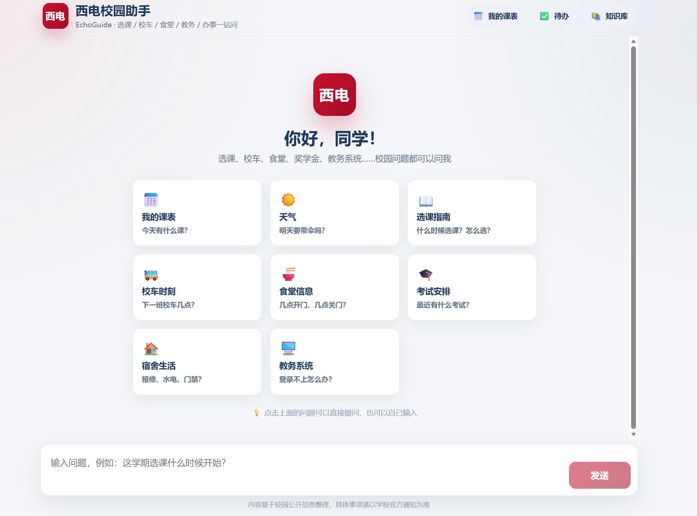

# EchoGuide — 西电校园智慧助手

面向西安电子科技大学（西电）师生的校园智能问答助手。基于多 Agent 编排 + 三级记忆 + RAG 知识库架构，覆盖**学业支持、校园生活、校务咨询、IT 支持**四大领域，并内置 **Agent 运行时安全治理**（EchoGuide Guard）与 **LLM-as-Judge 评测**体系。

> 说明：本项目为团队**自主设计、自主开发**的原生项目，从零构建完整的校园智能问答链路：意图体系、Agent 角色、Skills、知识库、评测用例、前端界面均独立设计与实现。

📄 技术亮点详解：见 [`docs/技术亮点.md`](docs/技术亮点.md)（二维意图识别、Agentic RAG 检索优化、三级记忆、多 Agent 路由、动态 Skills、监控闭环、评测体系、EchoGuide Guard 安全治理等）

---

## 功能总览



| 领域 | 覆盖内容 | 示例问题 |
|------|----------|----------|
| 🎓 学业支持 | 选课、课表、考试、成绩、绩点、重修、转专业、保研 | "这学期选课什么时候开始？" |
| 🏠 校园生活 | 宿舍、食堂、校车、校园卡、快递、水电、社团 | "南校区食堂几点关门？" |
| 📋 校务咨询 | 校历、请假、奖学金、证明开具、缴费、注册 | "奖学金什么时候评定？" |
| 🖥️ IT 支持 | 教务系统、校园网、VPN、邮箱、统一身份认证 | "教务系统登录不上怎么办？" |
| 🧑🎓 个人助理 | **我的课表（ICS 导入）、待办、考试/DDL 倒计时、日程提醒、天气、校车下一班、楼宇/场馆/图书馆查询** | "今天有什么课？" "我最近的考试安排？" "下一班校车几点？" |

**个人数据中心**（`personal/`）：学生通过「我的课表」上传教务系统导出的 `.ics` 文件或 JSON 课表（按 user_id 隔离，SQLite 持久化），即可在对话中问"今天/明天/周几有什么课、几点在哪上"；考试、DDL、作业待办可在对话中直接记录（"帮我记个待办，周三前交实验报告"），查询自动带倒计时。

**时间感知**：Agent 的 system prompt 统一注入当前日期、星期几、第几节课（西电作息表，夏季/秋冬春季自动切换）与教学周（默认 2026-2027 学年校历，`SEMESTER_START` 可配）——"现在第几节""这周第几周"可直接回答。

**外部 API 工具**：`get_weather`（Open-Meteo 免费数据源，无需 Key）等工具经 MCPToolManager 注册，Agent 通过 function calling 自主调用；`query_campus_info` 提供校车下一班（按当前时间精确计算）、楼宇、运动场馆、图书馆开放时间等**结构化公开信息**（数据在 `data/public/*.json`，缺失时如实提示并引导）。

- **多轮对话记忆**：Redis 工作记忆（24h TTL + LLM 自动压缩）+ ChromaDB 情景记忆（跨会话语义检索）+ 用户画像（**信号驱动提炼**：仅当用户消息含偏好/背景声明时调用 LLM 更新，普通提问不重复提炼；画像按用户单条聚合、去重上限 20 条）
- **多 Agent 路由**：层次化意图识别（领域 domain × 动作 action，LLM 70% + **本地真 Embedding 20%（all-MiniLM-L6-v2，384 维）** + 关键词 10%）→ 领域路由（动作不参与）→ 性能路由 → 降级兜底；短句追问自动继承上一轮领域；个人助理领域与学业领域同词命中时优先个人助理（"考试安排"不拆分回答）；**每领域双实例**，失败率升高被 Monitor 惩罚后自动切换另一实例（性能路由闭环真实生效）
- **轻量多 Agent 协作**：复杂请求由 **Task Planner** 拆分为自包含任务 DAG（规则命中时生成真实依赖链，如"查课表 + 查办理信息 → 创建待办"），**Executor** 按 `depends_on` 分波并行执行，结果写入 **SharedState** 并注入后续任务的协作上下文（后续 Agent 真正使用前序 Agent 结果），最后由 **Synthesizer** 合并为连贯回复（LLM 失败降级拼接）；不做 Agent 间聊天
- **Agent 工具权限边界**：按 Agent 类型做**最小权限**隔离（`AGENT_TOOL_ALLOWLIST`），职责外工具不暴露、调用直接拒绝——避免职责模糊、误调与多 Agent 重复执行；个人数据工具（课表/待办/DDL）只归 PersonalAgent
- **Agentic RAG**：Agent 通过 function calling 工具调用循环自主检索知识库（相关性阈值 + 领域过滤 + overlap 语义分块），回答带引用；检索层内置**查询改写（多角度子查询并行召回）+ LLM 重排**，Agent 调用 `knowledge_search` 与 `/search` 演示接口走同一优化链路；工具层以标准 MCP 协议（JSON-RPC 2.0）暴露，任何 MCP 客户端即插即用（见下方「MCP 客户端接入」）
- **动态 Skills**：可热加载的业务规范文件（SOP），关键词整词匹配 + 追问历史感知注入 system prompt（现覆盖五大领域）
- **流式对话**：SSE 逐 token 输出 + 工具调用过程实时可视化（`/chat/stream`）
- **双层语义缓存**：GPTCache 思路，相似问题直接复用答案（阈值 0.85，24h TTL）；**Global 层**只缓存不依赖用户上下文的答案（任何用户可复用），**User 层**按 `user_id` 隔离个性化答案（防跨用户串扰）；**个人数据领域（课表/待办等）绝不入缓存**
- **监控闭环**：Prometheus 指标 + Agent 在线表现统计 + 路由惩罚动态调整 + 全链路 Trace（`/traces`）
- **评测体系**：LLM-as-Judge 四维度评分（支持双模型：生成模型与评判模型可分离配置，消除自评偏差）+ 意图/路由/追问评测 + **RAG 检索硬指标（HitRate@K / Recall@K / MRR）与生成端引用正确性 / 忠实性 / 答案正确性** + 回归对比
- **安全治理**：EchoGuard 中间件**默认启用**（Prompt 注入检测 / 限流 / 脱敏审计，覆盖 /chat、/personal/*、/mcp；token 认证按需开启；中间件自身异常自动放行，不影响可用性）。独立的 Sidecar 参考实现已归档至 `docs/archive/echoguide-guard-sidecar/`

---

## 系统架构

```text
┌─────────────┐     ┌──────────────────────────────────────────────────────┐
│  Frontend   │     │                      FastAPI                          │
│ (Vue 3)     │ ──► │  /chat  /chat/stream  /mcp  /search  /knowledge/*     │
│  SSE 流式   │     │  /skills  /eval/run  /traces  /monitor                │
└─────────────┘     └───────────────┬──────────────────────────────────────┘
                                    │
                      ┌─────────────▼──────────────┐
                      │  AgentOrchestrator          │
                      │  ┌───────────────────────┐  │
                      │  │ IntentRecognizer       │  │ 领域×动作 二维意图
                      │  │ 层次化意图 + 追问继承    │  │ LLM+Embedding+Pattern
                      │  └───────────────────────┘  │
                      │  ┌─────┬─────┬─────┬─────┐  │
                      │  │Academic│Campus│Affairs│IT  │ 五领域 Agent
                      │  │  Life │      │  Help  │  │ + function calling
                      │  │  + PersonalAgent       │  │ 工具调用循环(Agentic RAG)
                      │  └─────┴─────┴─────┴─────┘  │
                      │  + SkillManager 动态注入 SOP  │
                      │  + 时间上下文注入（日期/第几节/第几周）│
                      └─────────────┬──────────────┘
                                    │
        ┌───────────────┬───────────┼───────────┬─────────────────┐
        ▼               ▼           ▼           ▼                 ▼
   Redis          ChromaDB     ChromaDB     KnowledgeBase  EchoGuide Guard
   工作记忆        情景记忆      用户画像      RAG 向量检索   中间件(默认启用)
        └───────────────┴───────────┴───────────┴─────────────────┘
   语义缓存(SemanticCache) / 个人数据中心(SQLite: 课表·待办·DDL) /
   结构化公开信息(data/public: 校车·楼宇·场馆·图书馆) /
   外部工具(Open-Meteo 天气) / Prometheus 监控 / LLM-as-Judge 评测 / Trace
```

> 任意 MCP 客户端（Claude Desktop 等）可经 `/mcp` 端点接入本系统的全部工具能力。

## MCP 客户端接入

EchoGuide 作为标准 **MCP Server**（JSON-RPC 2.0 / Streamable HTTP），把 8 个工具
（知识检索 / 课表 / 待办 / DDL / 校园信息 / 天气）开放给任意 MCP 客户端即插即用。

**Claude Desktop 配置示例**（`claude_desktop_config.json`）：

```json
{
  "mcpServers": {
    "echoguide": {
      "type": "http",
      "url": "http://localhost:8100/mcp",
      "headers": { "X-User-Id": "u1001" }
    }
  }
}
```

- `X-User-Id` 头传入用户身份（与前端 user_id 相同的软身份信任模型），
  个人工具（课表/待办/DDL）按该身份生效
- 端点受 EchoGuard 保护（限流 + 可选 token 认证）；协议方法：
  `initialize` / `tools/list` / `tools/call` / `ping`

## 技术栈

- **后端**：Python 3.12 · FastAPI · Anthropic SDK（兼容 DeepSeek）
- **记忆**：Redis（工作记忆）+ ChromaDB（情景记忆 / 用户画像 / RAG 知识库，内置 all-MiniLM-L6-v2 embedding）
- **前端**：Vue 3 + Vite，支持 Python/Java 双后端调试面板
- **部署**：Docker 多阶段构建（生产镜像 ~500MB）· Docker Compose · Nginx 反代 · Prometheus
- **质量**：pytest（业务逻辑 + EchoGuide Guard 安全测试 + RAG 硬指标单测）· LLM-as-Judge 评测

---

## 快速开始

### 1. 配置环境变量

```bash
cp .env.example .env
# 填写 ANTHROPIC_API_KEY（Claude 或 DeepSeek 兼容协议）
```

### 2. 本地运行后端

```bash
pip install -r requirements.txt
python -m uvicorn api.main:app --port 8000   # 本地直跑为 8000
```

或启动交互式 CLI：

```bash
python api/main.py --cli
```

> 端口说明：本地直接跑后端监听 **8000**；Docker Compose 部署后，Nginx 统一入口（前端页面 + API 转发）对外暴露 **8088**，API 直连端口为 8100（容器内部 8000）。

### 3. 本地运行前端（可选）

```bash
cd frontend
npm install
npm run dev   # http://localhost:5175
```

### 4. Docker Compose 一键部署

```bash
./build-image.sh
docker compose up -d
```

访问：`http://localhost:8088`（前端页面 + API 统一入口，Swagger 文档 `http://localhost:8088/docs`）

---

## 常用 API

| 方法 | 路径 | 说明 |
|------|------|------|
| POST | `/chat` | 对话主入口（message / user_id / conv_id），语义缓存优先 |
| POST | `/chat/stream` | 流式对话（SSE）：meta/tool/delta/done 事件序列，工具调用过程可视化 |
| POST | `/personal/schedule/import` · `/import/file` | 导入课表（JSON / ICS 文本 / .ics 文件上传） |
| GET · DELETE | `/personal/schedule` | 查看本周课表 / 清空课表（按 user_id） |
| POST · GET | `/personal/todo` | 新增 / 查看待办（kind: todo/ddl/exam，due_at 可选） |
| POST · DELETE | `/personal/todo/{id}/complete` · `/personal/todo/{id}` | 完成/恢复 / 删除待办 |
| GET | `/personal/overview` | 当日汇总：课程 + 待办 + 未来 7 天 DDL/考试倒计时 |
| GET | `/campus/info` · POST `/campus/reload` | 结构化公开信息（校车下一班/楼宇/场馆/图书馆）/ 热加载 |
| POST | `/mcp` | 标准 MCP 协议端点（JSON-RPC 2.0：initialize/tools/list/tools/call） |
| GET | `/health` | 健康检查 |
| GET | `/monitor` | Agent 实时表现摘要 |
| GET | `/traces` · `/traces/{id}` | 全链路 Trace 列表 / 详情（逐跳耗时） |
| POST | `/search?query=&top_k=` | RAG 检索优化链路演示（改写→召回→重排，与 /chat 的 Agent 检索共用） |
| POST | `/knowledge/add` | 批量导入知识文档 |
| POST | `/knowledge/upload` | 上传文件导入（txt/md/json） |
| GET | `/skills` · POST `/skills/reload` | Skills 查看 / 热加载 |
| POST | `/eval/run` | 运行评测（意图 + 多轮对话 + 路由/追问 + RAG 检索硬指标） |

## Skills 热加载

业务规范存放于 `skills/`（四个领域 SOP），修改后无需重启：

```bash
curl -X POST http://localhost:8088/skills/reload   # Docker 部署统一入口；本地直跑为 8000
```

## 测试

```bash
python -m pytest tests/ -q
```

覆盖：Skill 解析/匹配/注入、多 Agent 路由/降级/轻量协作流水线、二维意图投票与追问继承、子串误命中回归、MCP 协议、双层语义缓存决策、RAG 检索硬指标、EchoGuide Guard 安全策略/中间件/静态扫描、SSE 流式链路、Trace。

## 项目结构

```text
api/              FastAPI 入口、路由、CLI
agents/           多 Agent 编排（五领域 Agent + 轻量协作流水线 + 工具权限 + 时间注入）
core/             二维意图识别、Skill 加载器、领域词表、轻量 Trace
memory/           三级记忆（工作 / 情景 / 用户画像）
personal/         个人数据中心（SQLite 课表/待办/DDL、ICS 解析、时间上下文、查询服务）
campus/           结构化公开信息（校车时刻/楼宇/场馆/图书馆 加载与查询）
mcp/              RAG 知识库、工具框架、语义缓存、MCP 协议层
tools/            业务工具 handler（天气 Open-Meteo / 课表 / 待办 / DDL / 校园信息）
evaluation/       双模型 LLM-as-Judge 评测框架（意图/对话/路由 + RAG 硬指标）
echoguide_guard/  Agent 运行时安全中间件（默认启用：注入检测/限流/脱敏审计）
skills/           五领域业务 SOP（可热加载）
frontend/         Vue 3 调试面板（SSE 流式渲染 + 课表导入/待办面板）
config/           Prometheus 等运行配置
data/             demo 知识数据 / ChromaDB 持久化 / echoguide.db / public 公开信息
docs/             文档与历史归档
```
