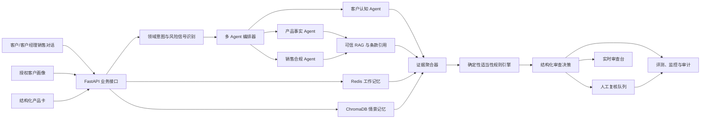

# 知适 SuitGuard：第五届中国研究生金融科技创新大赛项目实施计划

> 项目副标题：面向银行自营渠道的理财销售对话动态适当性与认知核验智能体  
> 参赛方向：自拟赛题赛道一——人工智能技术在金融领域的创新应用  
> 基础代码：EchoMind 现有后端工程  
> 计划版本：v1.1  
> 编制日期：2026-07-15  
> 最后复核：2026-07-16  
> 官方报名截止：2026-08-17  
> 官方作品截止：2026-08-31 15:00  
> 建议团队内部冻结时间：2026-08-30 12:00

---

## 1. 文档目的

本文档用于指导 EchoMind 从通用智能客服后端原型，改造成可参加第五届中国研究生金融科技创新大赛的完整金融科技项目。它同时承担以下作用：

1. 作为团队的统一项目定义，避免开发过程中不断扩张范围；
2. 作为产品、算法、后端、前端、数据、测试和参赛材料的联合实施计划；
3. 作为后续精益画布、技术文档、演示 PPT、演示视频和答辩稿的上游依据；
4. 作为原创性边界、数据合法性和安全合规工作的记录；
5. 作为最终项目验收的 Definition of Done（完成定义）。

本文档中的指标均为“计划目标”，在实验完成前不得写成已实现结果。最终提交、答辩和简历中只能使用真实测得且可复现的数字。

---

## 2. 执行摘要

### 2.1 最终选题

**知适 SuitGuard——面向银行自营渠道的理财销售对话动态适当性与认知核验智能体。**

系统部署在银行自营 App、网银理财销售流程或客户经理内部工作台中，在客户了解和购买非保本理财产品的过程中，对客户授权信息、产品事实、跨轮销售对话和风险认知进行联合审查，输出结构化、可追溯、可人工复核的适当性判断。

### 2.2 一句话价值

将传统“一次性风险问卷 + 人工抽查”升级为“贯穿销售对话的动态适当性审查”，帮助银行在交易前发现客户与产品风险错配、误导性表述、关键风险披露缺失和客户认知偏差。

### 2.3 产品的核心输出

系统不只回答问题，而是形成一张“适当性审查卡”，包含：

- 当前决策：`PASS`、`CLARIFY`、`BLOCK` 或 `HUMAN_REVIEW`；
- 客户与产品风险等级匹配情况；
- 命中的风险信号和原始对话片段；
- 产品说明书与监管规则的条款级引用；
- 尚未完成的风险披露或待确认问题；
- 客户风险认知核验结果；
- 是否触发人工复核及触发原因；
- 完整审计时间线和规则版本。

### 2.4 为什么选择这个方向

1. **金融场景足够具体。** 聚焦银行非保本理财产品的线上或客户经理辅助销售，不做泛金融问答。
2. **现有代码复用度高。** EchoMind 的多 Agent、三级记忆、RAG、Skills、监控、评测和 Docker 基础设施均可保留。
3. **不是简单换皮。** 新增确定性适当性规则引擎、条款级证据、结构化案件卡、真实人工复核闭环和领域评测集。
4. **有明确商业对象。** 目标客户是银行及理财公司，产品作为机构内部合规辅助模块或自营渠道能力交付。
5. **便于简历表达。** 可形成多智能体、可追溯 RAG、规则与模型混合决策、长短期记忆、RegTech、安全合规和端到端评测等技术成果。

### 2.5 MVP 范围冻结

首版只覆盖：

- 银行及理财公司发行或销售的非保本理财产品；
- 中文文本销售对话；
- 已授权、已结构化的客户风险等级和必要需求信息；
- 公开监管规则、公开产品披露文件或团队自制模拟产品卡；
- 银行自营渠道或内部客户经理工作台场景。

首版明确不做：

- 自动推荐客户购买具体产品；
- 自动替代银行完成最终销售审批；
- 根据对话擅自推断客户年龄、收入、资产或风险承受能力；
- 真实转账、扣款、申购、赎回或账户冻结；
- 声音、视频、OCR 和复杂票据识别；
- 证券、基金、期货、保险等所有金融品类的全覆盖；
- 预测产品收益、净值或市场走势；
- 面向公众独立提供理财咨询的第三方平台。

这些边界必须写进产品说明和演示材料，防止项目范围失控，也避免产生不必要的金融合规风险。

---

## 3. 比赛要求与项目响应

比赛依据：[《第五届中国研究生金融科技创新大赛参赛指南》](<D:/Desktop/工作文档/金融科技大赛/附件1：第五届中国研究生金融科技创新大赛参赛指南.pdf>)。

### 3.1 赛道一要求映射

| 比赛要求 | SuitGuard 的响应方式 | 最终证据 |
|---|---|---|
| 提升金融服务效率 | 自动识别风险错配、披露缺失和高风险话术，减少人工逐条审阅 | 人工平均审查时间对比 |
| 降低运营成本 | 风险分层，只将高风险或不确定案件提交人审 | 人审率、单案件成本估算 |
| 优化客户体验 | 通过通俗解释和“复述确认”发现真实理解偏差，避免机械弹窗 | 认知核验完成率、平均对话轮次 |
| 明确创新点 | 跨轮动态适当性、认知核验、规则与模型混合决策、条款级证据链 | 技术文档与消融实验 |
| AI 发挥核心作用 | AI 负责意图/风险信号识别、对话理解、产品事实提取、RAG 检索和认知语义判断 | 模型输出、对比基线、消融实验 |
| 技术可行性 | 基于现有 FastAPI、Redis、ChromaDB、Docker 和多 Agent 工程实施 | 一键部署与统一测试脚本 |
| 商业可推广性 | 作为银行自营渠道/API/客户经理工作台的可插拔模块 | 产品架构和机构接入方案 |
| 真数据与合法来源 | 官方规则、公开文件、模拟产品卡、脱敏合成对话，并建立来源登记 | 数据来源合法性说明 |
| 可运行、可测试 | 提供 Docker Compose、种子数据、演示模式、健康检查和测试报告 | 提交包与运行说明 |

### 3.2 必交材料

初赛必须准备：

1. 一页精益画布；
2. 可运行、可测试的完整项目成果；
3. 技术文档；
4. 原创性声明。

此外，自拟赛题必须准备数据来源合法性证明。团队内部将其作为第五项强制材料管理。

### 3.3 关键时间点

| 日期 | 事项 | 团队内部要求 |
|---|---|---|
| 2026-07-17 | 选题和 MVP 范围冻结 | 不再新增金融品类 |
| 2026-07-24 | 领域模型和规则引擎可运行 | 能输出第一版结构化决策 |
| 2026-08-02 | RAG、数据集和 Agent 主链路打通 | 完成端到端演示 1.0 |
| 2026-08-11 | 前端审查台和人工复核闭环完成 | 演示不依赖 Swagger |
| 2026-08-17 | 官方报名截止 | 至少提前 48 小时核对报名信息 |
| 2026-08-18 | 功能冻结 | 后续只修 Bug、做实验和材料 |
| 2026-08-25 | 实验和技术文档冻结 | 所有数字可复现 |
| 2026-08-28 | 提交包候选版完成 | 换一台干净机器部署验证 |
| 2026-08-30 12:00 | 团队内部提交冻结 | 留出一天处理上传和格式问题 |
| 2026-08-31 15:00 | 官方作品截止 | 禁止压线上传 |

### 3.4 报名、组队与匿名要求

提交前必须逐项核对：

- 参赛者符合正式在籍研究生、已取得读研资格且能提供证明的本科生，或能提供相应证明的本研贯通学生要求；
- 以团队形式参赛并指定一名队长，每队不超过 6 人；
- 以队长所在培养单位作为参赛单位；跨校团队完整填写所有成员院校信息；
- 每队最多 2 名指导教师，每名指导教师最多指导 3 支队伍；
- 队员、队长和指导教师如需调整，必须在报名截止前完成；
- 资格审核通过后不得变更赛题；
- 团队名称不得包含学校全称、简称、英文名、英文缩写或常见网络昵称；
- 源代码界面、精益画布、技术文档、PPT、视频、截图和模拟数据中不得出现学校 Logo、校名、校徽或其他可识别学校身份的标识；
- 如果同时参加“揭榜挂帅”和自拟赛题，每个赛道各限一个赛题或方向，且同一成果不得重复使用；
- 核查 EchoMind 或其改造版本是否曾在中国研究生创新实践系列大赛其他赛事或往届本赛事获奖，避免同一作品重复参赛；
- 商业敏感流程和未公开指标全部脱敏；涉及个人信息的数据处理符合《中华人民共和国个人信息保护法》等适用要求；
- 比赛成果知识产权和第三方组件许可边界清楚。

匿名检查不仅针对最终 PPT，也覆盖程序界面、默认用户名、截图、文件属性、Git 远程地址、日志、演示账号和导出报告。提交包中如保留 Git 元数据，应确认其中不会暴露学校信息；更稳妥的方式是提交经过清理的源代码副本而不是完整 `.git` 目录。

### 3.5 提交包装要求

初赛压缩包应按材料类别分别建立文件夹，每个文件夹下建立 `readme.txt`，说明该文件夹作用、关键文件、启动方式和依赖。最终压缩包按指南格式命名为“赛道名称－自拟赛题方向－团队名称”。

建议内部目录：

```text
自拟赛题-人工智能-团队名称/
├── 01-精益画布/
│   ├── 精益画布.pdf
│   └── readme.txt
├── 02-可运行项目/
│   ├── source/
│   ├── demo-data/
│   ├── docker-compose.yml
│   ├── RUNBOOK.md
│   └── readme.txt
├── 03-技术文档/
│   ├── 技术文档.pdf
│   └── readme.txt
├── 04-原创性声明/
│   ├── 原创性声明.pdf
│   └── readme.txt
└── 05-数据合法性证明/
    ├── 数据来源说明.pdf
    ├── source_registry.csv
    └── readme.txt
```

决赛还需准备完整可运行成果、组委会统一模板 PPT，以及嵌入 PPT 且不超过 1 分钟的演示视频；视频文件与 PPT 放在同一文件夹。现场演示时长不得超过 8 分钟。

---

## 4. 业务问题定义

### 4.1 当前业务痛点

理财产品适当性管理通常包含客户风险评估、产品风险评级、风险匹配、信息披露、风险提示和销售留痕。现有流程常见的技术痛点包括：

1. **风险测评与销售对话分离。** 客户完成一次问卷后，后续对话中新增的期限、流动性和资金用途信息未必回流到适当性判断。
2. **客户“点击已阅读”不等于真正理解。** 传统风险揭示主要验证流程是否完成，很难识别客户仍将非保本产品理解为存款的情况。
3. **产品文件长且版本多。** 客户经理或审查人员难以及时定位产品的本金风险、持有期限、赎回限制、费用和适用客户等条款。
4. **销售话术审查滞后。** “基本不会亏”“随时都能取”等表述可能与正式产品文件不一致，事后抽查难以及时阻断。
5. **人工审查成本高。** 对所有对话进行同等强度审核会造成资源浪费，但纯模型自动放行又不可控。
6. **证据链不完整。** 即使模型提示有风险，如果没有原话、条款、规则版本和决策原因，也很难用于内部复核。

### 4.2 目标用户

| 用户 | 主要需求 | SuitGuard 提供的能力 |
|---|---|---|
| 客户经理 | 快速了解哪些话术或披露存在风险 | 实时提示、合规改写、缺失问题清单 |
| 合规/消保审查人员 | 快速复核高风险案件 | 风险分层、证据片段、条款依据和审计卡 |
| 产品管理人员 | 确保产品事实和风险要素一致 | 产品卡、版本管理、条款级检索 |
| 普通客户 | 得到清晰、不过度营销的风险解释 | 通俗风险说明和认知核验问题 |
| 技术运维人员 | 观察模型、工具和规则的运行状态 | 指标、告警、熔断、规则版本和回归评测 |

### 4.3 核心业务目标

1. 尽可能减少严重风险的漏检；
2. 将人工审查集中在高风险和不确定案件；
3. 提高产品事实和监管条款引用的准确性；
4. 用可解释证据支持人工判断，而非输出不可追溯的模型结论；
5. 在不增加客户不必要负担的情况下核验其风险理解；
6. 保证系统在无真实客户数据、无真实交易权限的演示环境中仍可完整运行。

### 4.4 成功标准

项目成功不以“聊天自然”作为唯一标准，而以以下闭环是否成立判断：

```text
输入客户与产品事实
  → 识别跨轮风险信号
  → 检索并引用可信条款
  → 确定性规则做最终门控
  → 需要时触发认知核验
  → 生成结构化审查卡
  → 高风险案件进入人工复核
  → 全流程可回放、可评测、可部署
```

---

## 5. 产品方案

### 5.1 典型使用流程

#### 阶段 A：销售前准备

1. 产品管理员导入产品说明书、风险揭示书和模拟产品卡；
2. 系统提取产品类型、风险等级、期限、流动性、本金风险、费用和适用客户等字段；
3. 管理人员确认结构化产品事实；
4. 合规人员加载机构规则和监管条款；
5. 客户在授权后提供风险等级、投资期限、资金用途和流动性要求等必要字段。

#### 阶段 B：销售对话审查

1. 客户经理或模拟对话接口提交一轮对话；
2. 系统读取当前会话、历史摘要和已授权画像；
3. 意图识别器识别产品咨询、风险披露、收益表述、流动性问题、费用问题、认知偏差或人工复核诉求；
4. 产品事实 Agent 和合规审查 Agent 并行处理；
5. 证据聚合器合并原话、产品条款和监管依据；
6. 确定性规则引擎做最终门控；
7. 系统返回实时风险提示或继续销售所需的补充问题。

#### 阶段 C：认知核验

当客户出现以下情形之一时触发：

- 将理财产品等同于存款；
- 认为产品保本或收益确定；
- 误解最短持有期、赎回限制或到账时间；
- 对本金损失、费用或波动风险的回答与产品事实冲突；
- 多轮对话中出现前后矛盾的资金用途或流动性需求。

系统采用“复述确认”方式，让客户用自己的话回答关键问题。模型负责比较语义是否一致，但最终门控由规则引擎完成。一次认知核验失败进入 `CLARIFY`，连续失败或涉及严重风险时进入 `HUMAN_REVIEW`。

本文使用的 C1–C5 客户等级和 R1–R5 产品等级仅作为比赛模拟数据的可配置示例，不声称它们是所有金融机构统一采用的法定标准。真实部署必须接入机构已经审批的风险分级、匹配矩阵和例外处理规则。

#### 阶段 D：人工复核

1. 系统创建审查案件；
2. 审查员看到风险摘要、命中原话、产品条款、监管依据和规则版本；
3. 审查员可以选择通过、要求补充信息、阻断或退回整改；
4. 人工决定和理由写入审计日志；
5. 已确认标注可进入后续离线评测集，但不得未经处理直接用于在线模型训练。

### 5.2 结构化决策状态

| 状态 | 含义 | 典型触发 | 系统动作 |
|---|---|---|---|
| `PASS` | 当前证据未发现阻断条件 | 风险等级匹配、关键披露完成、认知通过 | 允许流程继续并记录证据 |
| `CLARIFY` | 信息不足或存在可澄清矛盾 | 客户期限不明确、风险理解回答不完整 | 生成最少必要追问 |
| `BLOCK` | 命中明确的硬性不匹配或禁止条件 | 客户风险承受能力低于产品风险等级 | 阻止自动继续，必须处理 |
| `HUMAN_REVIEW` | 高风险、模型不确定或规则要求人工 | 严重误导话术、连续认知失败、画像过期 | 创建人工复核案件 |

### 5.3 示例审查结果

```json
{
  "case_id": "SG-DEMO-0001",
  "decision": "HUMAN_REVIEW",
  "risk_level": "HIGH",
  "customer_profile": {
    "risk_level": "C2",
    "investment_horizon_months": 3,
    "liquidity_need": "HIGH",
    "profile_source": "AUTHORIZED_SIMULATION",
    "profile_version": "2026-07-15"
  },
  "product": {
    "product_id": "DEMO-R4-001",
    "risk_level": "R4",
    "minimum_holding_days": 180,
    "principal_guaranteed": false
  },
  "signals": [
    {
      "type": "RISK_LEVEL_MISMATCH",
      "severity": "CRITICAL",
      "evidence": "客户 C2，产品 R4",
      "source": "deterministic_rule"
    },
    {
      "type": "MISLEADING_GUARANTEE_LANGUAGE",
      "severity": "HIGH",
      "evidence": "客户经理：这个基本不会亏",
      "source": "conversation_turn_4"
    },
    {
      "type": "LIQUIDITY_CONFLICT",
      "severity": "HIGH",
      "evidence": "客户表示三个月后必须用款；产品最短持有期180天",
      "source": "memory_plus_product_fact"
    }
  ],
  "rule_references": [
    {
      "document": "金融机构产品适当性管理办法",
      "section": "适当性匹配相关条款",
      "effective_date": "2026-02-01",
      "source_url": "https://www.nfra.gov.cn/"
    }
  ],
  "missing_disclosures": ["本金损失可能性", "最短持有期", "提前赎回限制"],
  "comprehension_check": {
    "status": "FAILED",
    "attempts": 2,
    "reason": "客户仍认为产品保本"
  },
  "human_review_required": true,
  "rule_set_version": "suitguard-rules-1.0.0"
}
```

### 5.4 非功能需求

| 类别 | 要求 |
|---|---|
| 可运行性 | 一条命令启动；无 API Key 时可进入明确标注的降级演示模式 |
| 可追溯性 | 每条高风险结论至少对应一个原始证据或确定性规则 |
| 可复现性 | 固定种子数据和测试配置，同一版本可复现实验结果 |
| 安全性 | 鉴权、角色权限、脱敏、最小化存储、删除接口和审计日志 |
| 稳定性 | 外部模型、Redis 或 ChromaDB 异常时有降级与告警 |
| 可维护性 | 监管规则和业务规则通过版本化配置或 Skill 更新 |
| 可观测性 | 统计端到端延迟、调用成本、失败率、人工升级率和规则命中率 |
| 可演示性 | 现场演示不依赖真实金融系统、真实客户或真实交易权限 |

---

## 6. 技术架构

### 6.1 总体架构



### 6.2 设计原则

1. **模型负责理解，规则负责门控。** LLM 可以识别语义、生成追问和解释，但不得绕过确定性阻断规则。
2. **检索结果不是事实本身。** 所有用于决策的产品事实应来自经过确认的结构化产品卡或带来源的原文片段。
3. **不确定就升级。** 严重风险、证据冲突、模型低置信度或规则版本异常时优先人工复核。
4. **画像必须显式授权。** 不将模型推断的年龄、财富、健康或风险等级当作事实。
5. **全链路可回放。** 保存规则版本、模型版本、提示词版本、知识文档版本和人工决定。
6. **降级模式透明。** 外部模型不可用时，页面必须明确显示当前为规则/模板降级，不伪装成完整 AI 结果。

### 6.3 Agent 设计

| Agent | 输入 | 职责 | 输出 | 禁止事项 |
|---|---|---|---|---|
| `ProductFactAgent` | 产品 ID、客户问题、RAG 结果 | 提取产品风险、期限、流动性、费用、本金风险和适用客户 | 结构化产品事实及引用 | 不预测收益，不补造条款 |
| `SalesComplianceAgent` | 销售对话、规则库 | 识别收益承诺、产品混淆、诱导表述、披露缺失 | 风险片段、严重度、规则引用 | 不独立作最终放行决定 |
| `CustomerUnderstandingAgent` | 客户明确陈述、授权画像、历史对话 | 识别理解偏差和前后矛盾，生成最少必要追问 | 认知状态和核验问题 | 不擅自推断风险等级或资产 |
| `HumanReviewGateway` | 聚合证据、规则结果 | 创建人工复核案件并跟踪状态 | 案件 ID、复核原因、审计状态 | 不假装已经获得人工批准 |

`HumanReviewGateway` 首版可以是服务组件而非 LLM Agent。这样更符合金融系统中“人机协同、机器不越权”的定位。

### 6.4 确定性规则引擎

规则分为四类：

1. **硬阻断规则**：产品风险等级高于客户风险承受能力、必要画像已过期且无法确认等；
2. **强制人审规则**：严重误导性表述、连续认知失败、关键证据冲突；
3. **澄清规则**：投资期限、流动性要求、产品版本或客户目标缺失；
4. **提示规则**：一般风险解释、非关键字段补充和通俗化说明。

建议决策优先级：

```text
硬阻断规则
  > 强制人审规则
  > 证据冲突或低置信度
  > 信息缺失需要澄清
  > 正常通过
```

规则采用版本化 YAML 或 JSON 管理，至少包含：

```yaml
id: RISK_LEVEL_MISMATCH
version: 1.0.0
enabled: true
priority: 100
condition: product.risk_rank > customer.risk_rank
decision: BLOCK
severity: CRITICAL
requires_human_review: true
evidence_fields:
  - product.risk_level
  - customer.risk_level
```

不得把所有判断都写在提示词里，否则无法稳定测试、审计和解释。

### 6.5 RAG 与知识治理

#### 知识来源

1. 金融监管总局正式发布的现行规则；
2. 中国人民银行、中国证监会等官方公开规则中与场景直接相关的内容；
3. 银行或理财公司公开的产品说明书和风险揭示材料；
4. 团队自制、明确标注“模拟”的产品卡和业务 SOP；
5. 经过人工确认的术语表和风险解释模板。

#### 知识片段元数据

现有知识库只有 `title`、`content` 和 chunk 信息，必须扩展为：

```json
{
  "document_id": "NFRA-SUITABILITY-2025-07",
  "title": "金融机构产品适当性管理办法",
  "issuer": "国家金融监督管理总局",
  "document_type": "regulation",
  "version": "2025-07-11",
  "effective_date": "2026-02-01",
  "section": "第二章",
  "article": "第十四条",
  "page": 4,
  "source_url": "https://www.nfra.gov.cn/",
  "content_hash": "sha256:...",
  "is_current": true,
  "data_license_note": "政府网站公开文件，仅用于比赛研究与引用"
}
```

#### 检索流程

```text
原始问题
  → 领域查询改写
  → 按文档类型/生效日期/产品 ID 过滤
  → 向量与关键词混合召回
  → 合并去重
  → LLM 或轻量 Cross-Encoder 重排
  → 返回 Top-K 原文与元数据
  → 生成答案前进行引用支持校验
```

#### 防幻觉与提示注入

1. 文档内容按“不可信数据”处理，不允许其覆盖系统指令；
2. 产品事实优先使用已经人工确认的结构化字段；
3. 生成内容中的金额、期限、风险等级和费用必须能映射到证据字段；
4. 无证据时输出“无法确认”，不得根据常识补造；
5. 每次输出保存引用文档 ID、chunk ID 和版本；
6. 对包含“忽略以上指令”等内容的文档进行隔离和告警；
7. 建立引用支持校验器，检查每个关键事实是否有对应证据。

### 6.6 记忆设计

EchoMind 现有 Redis 工作记忆、ChromaDB 情景记忆和用户画像可继续复用，但画像内容必须重构。

允许保存的字段：

- 授权的风险等级及评估日期；
- 客户明确陈述的资金用途；
- 客户明确陈述的投资期限和流动性要求；
- 客户明确陈述的风险偏好；
- 已完成的风险披露项目；
- 认知核验问题、客户回答及核验结果；
- 对话摘要、案件状态和人工处理结果。

禁止直接将以下模型推断写为事实：

- 年龄、收入、资产规模、健康状况；
- 是否属于所谓“脆弱客户”；
- 客户风险承受能力等级；
- 客户家庭关系或职业；
- 任何未得到授权的敏感个人信息。

记忆必须提供 TTL、按用户删除、按案件导出和脱敏能力。比赛演示数据全部使用虚构 ID。

### 6.7 模型调用优化

当前主链路一次对话可能产生多次 LLM 调用，后续应合并和缓存：

1. 意图与实体抽取合并为一次结构化输出；
2. 产品事实在导入时预提取，在线阶段直接查询；
3. 查询改写只在问题复杂或首次召回不足时触发；
4. 重排只对候选数量超过阈值时触发；
5. 认知核验只在规则触发时调用；
6. 对产品卡和规则使用版本化缓存；
7. 端到端延迟必须从请求进入 API 时开始统计，包含记忆、RAG、模型和规则引擎。

---

## 7. 领域数据模型

### 7.1 `CustomerProfile`

| 字段 | 类型 | 必填 | 来源限制 |
|---|---|---:|---|
| `customer_id` | string | 是 | 模拟或脱敏 ID |
| `risk_level` | enum | 是 | 授权的结构化字段，不允许模型推断 |
| `risk_assessed_at` | datetime | 是 | 模拟业务系统 |
| `investment_horizon_months` | integer | 否 | 客户明确陈述或授权字段 |
| `liquidity_need` | enum | 否 | 客户明确陈述 |
| `investment_goal` | string | 否 | 客户明确陈述 |
| `profile_version` | string | 是 | 审计用途 |
| `consent_scope` | array | 是 | 明确哪些字段可用于本次审查 |

### 7.2 `ProductCard`

| 字段 | 类型 | 说明 |
|---|---|---|
| `product_id` | string | 产品唯一标识 |
| `name` | string | 模拟或公开产品名称 |
| `product_type` | string | 首版固定为银行理财相关类型 |
| `risk_level` | enum | R1–R5 或机构配置映射 |
| `principal_guaranteed` | boolean | 是否保本 |
| `minimum_holding_days` | integer | 最短持有期 |
| `redemption_rules` | object | 赎回窗口、到账规则等 |
| `fee_items` | array | 费用名称、计算口径和出处 |
| `key_risks` | array | 关键风险 |
| `eligible_customer_levels` | array | 适用客户等级 |
| `source_document_ids` | array | 证据来源 |
| `confirmed_by_human` | boolean | 是否经过人工确认 |
| `version` | string | 产品事实版本 |

### 7.3 `EvidenceSpan`

| 字段 | 说明 |
|---|---|
| `evidence_id` | 证据唯一 ID |
| `source_type` | 对话、产品卡、监管条款、客户画像、人工决定 |
| `source_id` | 对应消息或文档 ID |
| `text` | 原始证据文本 |
| `start_offset/end_offset` | 对话中的字符位置，可选 |
| `label` | 风险错配、收益承诺、流动性冲突等 |
| `confidence` | 模型置信度，仅供参考 |
| `verified` | 是否经过规则或人工验证 |

### 7.4 `ReviewCase`

案件至少包含：案件 ID、客户 ID、产品 ID、会话 ID、创建时间、当前状态、风险信号、证据、规则结果、认知核验结果、模型和提示词版本、知识库版本、人工决定、处理理由和完整审计事件。

---

## 8. 数据方案与合法性

### 8.1 数据组成

建议首版构建以下数据：

| 数据 | 计划规模 | 用途 |
|---|---:|---|
| 官方监管文件 | 10–20 份 | RAG、规则依据和引用评测 |
| 模拟产品卡 | 20 个 | 覆盖 R1–R5、不同期限和流动性 |
| 单轮风险语句 | 500 条 | 意图、风险标签和证据片段检测 |
| 多轮销售对话 | 300 组 | 端到端决策、记忆和认知核验 |
| 认知核验问答对 | 200 组 | 判断客户是否真正理解关键风险 |
| 人工复核案件 | 100 组 | 人审状态、证据完整性和审计流程 |

规模可根据人力下调，但必须保证测试集独立、标签清楚和场景覆盖均衡。宁可做 150 组高质量多轮对话，也不要做 2,000 组未经人工检查的模型自生成数据。

### 8.2 多轮对话覆盖矩阵

至少覆盖：

- 风险等级匹配与不匹配；
- 将理财产品与存款混淆；
- 明示或暗示保本保收益；
- 只展示过往业绩或单一有利区间；
- 期限与客户资金用途冲突；
- 赎回限制或到账时间理解错误；
- 费用披露缺失；
- 客户前后陈述矛盾；
- 信息不足但可以澄清；
- 模型低置信度应转人工；
- 正常、完整、可通过的负样本；
- 文档检索不到或证据冲突的异常情况；
- 恶意提示注入和对话越权测试。

### 8.3 标注规范

每组对话标注：

1. 主意图和次意图；
2. 风险信号类别；
3. 风险证据起止片段；
4. 严重度；
5. 应引用的产品事实和监管条款；
6. 应采取的决策状态；
7. 是否需要认知核验；
8. 是否必须人工复核；
9. 标准解释和不能出现的错误解释；
10. 标注人和复核人。

严重风险样本建议双人标注；不一致时由第三人或团队负责人裁决，并记录一致性指标。

### 8.4 数据集划分

建议按“产品和对话模板族”分组后再划分，防止同一模板改几个词同时进入训练和测试：

- 训练/开发集：60%；
- 验证集：20%；
- 独立测试集：20%。

如果系统不训练模型，训练集仍可用于提示词开发、规则调试和错误分析；独立测试集在功能冻结前不得查看详细答案。

### 8.5 合法性登记

建立 `data/source_registry.csv` 或等价文件，字段至少包括：

- `source_id`；
- 文件名称；
- 发布机构；
- 原始 URL；
- 获取日期；
- 是否公开；
- 使用范围；
- 是否包含个人信息；
- 脱敏方式；
- 版权或引用说明；
- 文件哈希；
- 项目内存放位置。

模拟数据必须注明生成方式、使用的提示词版本、人工检查方式和不包含真实个人信息的声明。不得将真实客户对话、内部风控规则或未公开产品数据混入提交包。

---

## 9. 评测设计

### 9.1 评测原则

1. 不以当前少量客服样本的“100%准确率”作为任何参赛证据；
2. 不只依赖与生成模型同源的 LLM-as-Judge；
3. 严重风险漏检的代价高于一般误报，核心指标优先看召回率和不安全放行率；
4. 所有指标必须可通过固定命令复现；
5. 评测必须走与生产相同的记忆、RAG、Agent、规则和 API 链路。

### 9.2 指标与计划目标

下表为项目验收目标，不代表当前已经达到：

| 能力 | 指标 | 计划目标 |
|---|---|---:|
| 严重风险识别 | Critical Risk Recall | ≥ 0.95 |
| 风险片段检测 | Span-level F1 | ≥ 0.85 |
| 适当性决策 | Macro-F1 | ≥ 0.90 |
| 不安全放行 | Unsafe Pass Rate | ≤ 0.01 |
| 强制升级 | Human Escalation Recall | ≥ 0.95 |
| 条款检索 | Recall@5 | ≥ 0.90 |
| 引用准确性 | Citation Precision | ≥ 0.95 |
| 事实可支持性 | Claim Support Rate | ≥ 0.95 |
| 认知核验 | Comprehension Accuracy | ≥ 0.85 |
| 端到端延迟 | P95 Latency | ≤ 10 秒 |
| 可运行性 | 干净环境部署成功率 | 100%（至少 3 次独立验证） |

如果达不到目标，技术文档必须如实报告结果、失败类型、原因和后续改进，不能修改测试集来“追数字”。

### 9.3 基线系统

至少比较：

1. 纯关键词规则；
2. 单 Agent + 无 RAG；
3. 单 Agent + 普通 RAG；
4. 多 Agent + RAG，但无确定性门控；
5. 完整 SuitGuard。

### 9.4 消融实验

分别移除：

- 跨轮记忆；
- 查询改写；
- 重排；
- 产品结构化卡；
- 监管条款引用；
- 认知核验；
- 确定性规则引擎；
- 多 Agent 并行。

重点回答：

- 记忆是否降低了对跨轮矛盾的漏检？
- 条款级 RAG 是否降低了无依据表述？
- 规则引擎是否降低了不安全放行率？
- 多 Agent 是否带来准确率提升，提升是否值得额外延迟和成本？

### 9.5 错误分析

每轮评测输出混淆矩阵和错误案例，错误至少分为：

- 意图识别错误；
- 实体/字段提取错误；
- 检索失败；
- 引用错误；
- 对话记忆污染；
- 规则配置错误；
- 模型理解错误；
- 决策聚合错误；
- 不该升级但升级；
- 应升级却未升级；
- 外部服务失败或超时。

---

## 10. 现有代码审查结论

### 10.1 可复用部分

| 模块 | 当前文件 | 复用判断 |
|---|---|---|
| FastAPI 主服务 | `api/main.py` | 保留应用骨架，重做领域 API |
| 多 Agent 编排 | `agents/agent_orchestrator.py` | 保留路由、并行、降级和统计框架 |
| 意图识别 | `core/intent_recognizer.py` | 保留三路融合结构，替换标签、模板和实体 |
| Skill 热加载 | `core/skill_loader.py` | 直接复用，增加金融规则 Skills |
| 工具管理 | `mcp/tool_manager.py` | 保留缓存、熔断、降级、改写和重排 |
| 知识库 | `mcp/knowledge_base.py` | 保留 ChromaDB，重做元数据、版本和引用 |
| 三级记忆 | `memory/conversation_memory.py` | 保留结构，重做授权画像、TTL 和删除 |
| 监控 | `monitor/performance_monitor.py` | 保留框架，增加业务风险指标 |
| 评测 | `evaluation/evaluator.py` | 保留报告框架，重做数据和指标 |
| 部署 | `Dockerfile`、`docker-compose.yml` | 保留并补充前端、种子数据和健康检查 |

### 10.2 当前不能对外宣称的能力

1. `MCPToolManager` 当前是进程内工具注册与治理组件，不是完整 MCP 协议服务器；
2. 每类 Agent 只有一个实例，所谓动态性能路由尚无真实的多实例选择；
3. `ESCALATION` 当前只设置布尔标记，没有真实工单或人工审核队列；
4. 当前评测样本少且与 Few-shot 模板重合，不能将 100% 结果写入材料；
5. 当前响应延迟只覆盖编排部分，未覆盖完整 RAG 和记忆链路；
6. 示例知识中关于 SOC2、完全隔离、92% 准确率、召回提升 40% 等内容没有证据，必须删除或替换为真实测量结果。

### 10.3 P0 安全问题

在任何公开、提交或演示前必须完成：

1. 当前 `.env` 已被 Git 跟踪，且含非占位 API Key；立即轮换密钥、取消跟踪并清理 Git 历史；
2. 关闭全开放 CORS，改为明确的演示前端来源；
3. 增加身份认证和角色权限；
4. 禁止调用者任意读取其他用户的 `user_id/conv_id`；
5. 为知识上传、规则重载、评测运行和人工决定接口增加管理员权限；
6. 为长期记忆增加 TTL、删除、导出和脱敏；
7. 外发给 LLM 前进行字段最小化和敏感信息脱敏；
8. 增加 RAG 提示注入检测和输出事实校验；
9. 从提交包移除真实日志、缓存、Chroma 二进制数据、IDE 文件和本地密钥；
10. 恢复或重写当前工作树中被删除的 README/wiki，并保留用户已有修改，禁止使用破坏性 Git 重置。

### 10.4 性能与工程债

1. `async` 接口内存在同步 Redis/Chroma 调用，可能阻塞事件循环；
2. 意图缓存只按消息文本生成键，忽略会话上下文；
3. 融合意图结果返回的置信度仍是 LLM 单路置信度；
4. 一次请求存在重复意图识别器实例和多次模型调用；
5. 无单元测试、集成测试和端到端测试目录；
6. 无前端和人工审核界面；
7. 外部模型或默认 Embedding 下载失败时，可运行性存在风险。

这些问题按本计划的 P0、P1、P2 里程碑依次处理。

---

## 11. 文件级改造计划

### 11.1 建议新增目录

```text
EchoMind/
├── domain/
│   ├── models.py                 # 客户、产品、证据、案件和决策模型
│   ├── suitability_engine.py     # 确定性适当性门控
│   ├── evidence_aggregator.py    # 多来源证据合并与冲突检测
│   ├── comprehension.py          # 认知核验状态机
│   └── audit.py                  # 审计事件与案件状态
├── tools/
│   ├── mock_customer_profile.py  # 模拟客户画像查询
│   ├── mock_product_catalog.py   # 模拟产品卡查询
│   └── citation_validator.py     # 引用支持校验
├── rules/
│   ├── suitability_rules.yaml
│   ├── disclosure_rules.yaml
│   └── rule_manifest.json
├── web/
│   ├── src/                      # React + TypeScript 前端
│   └── package.json
├── tests/
│   ├── unit/
│   ├── integration/
│   ├── e2e/
│   └── fixtures/
├── data/
│   ├── regulations/
│   ├── product_cards/
│   ├── scenarios/
│   ├── eval/
│   └── source_registry.csv
└── docs/
    ├── competition/
    ├── data/
    ├── architecture/
    └── runbook/
```

### 11.2 现有文件修改表

| 文件 | 主要修改 | 验收标准 |
|---|---|---|
| `core/intent_recognizer.py` | 替换客服标签；合并意图与实体抽取；缓存键加入上下文摘要和产品 ID | 金融意图测试集 Macro-F1 达标 |
| `agents/agent_orchestrator.py` | 替换 AgentType、系统提示和协作逻辑；接入结构化输出 | 能并行返回产品与合规证据 |
| `core/skill_loader.py` | 保留逻辑，增加规则版本和来源字段校验 | 热加载可审计、失败可回滚 |
| `mcp/knowledge_base.py` | 扩展元数据、版本过滤、来源 URL、条款/页码和哈希 | 搜索结果可定位到原文 |
| `mcp/tool_manager.py` | 增加产品卡/客户画像模拟工具；改进超时与成本统计 | 工具失败有降级且不误放行 |
| `memory/conversation_memory.py` | 重写画像提炼；增加授权范围、TTL、删除和审计 | 不保存未经授权的敏感推断 |
| `api/main.py` | 新增领域 API、鉴权、案件管理和真实端到端计时 | 前端可完成完整演示 |
| `monitor/performance_monitor.py` | 增加严重风险命中、人审率、规则命中、引用失败等指标 | 仪表板可观察业务与系统指标 |
| `evaluation/evaluator.py` | 评测走生产链路，增加确定性指标和独立数据集 | 一条命令输出可复现报告 |
| `docker-compose.yml` | 增加前端/种子任务、健康检查、最小化环境变量 | 干净机器可一键启动 |
| `data/demo_docs/*` | 删除通用客服内容及无依据宣传，换成合法来源的比赛数据 | 提交包不含虚假声明 |

### 11.3 领域意图标签

建议首版标签：

```text
PRODUCT_INFORMATION
RISK_DISCLOSURE
RETURN_GUARANTEE_LANGUAGE
PRODUCT_CONFUSION
LIQUIDITY_REQUIREMENT
FEE_INQUIRY
SUITABILITY_MISMATCH
COMPREHENSION_GAP
PRIVACY_REQUEST
HUMAN_REVIEW_REQUEST
GREETING
OTHER
```

允许一条对话有一个主意图和多个风险标签，避免继续用单标签意图承担全部业务判断。

### 11.4 API 设计

建议主接口：

| 方法 | 路径 | 作用 | 权限 |
|---|---|---|---|
| `POST` | `/api/v1/reviews/analyze` | 提交一轮对话并返回结构化审查结果 | 客户经理/系统 |
| `GET` | `/api/v1/cases/{case_id}` | 查看案件和完整证据 | 审查员 |
| `POST` | `/api/v1/cases/{case_id}/decision` | 提交人工决定 | 审查员 |
| `GET` | `/api/v1/cases` | 按风险和状态查询案件 | 审查员 |
| `POST` | `/api/v1/products` | 导入或更新模拟产品卡 | 产品管理员 |
| `GET` | `/api/v1/products/{product_id}` | 查看产品事实与来源 | 已认证用户 |
| `POST` | `/api/v1/knowledge/upload` | 导入监管或产品文档 | 管理员 |
| `POST` | `/api/v1/rules/reload` | 重载规则并创建新版本 | 管理员 |
| `POST` | `/api/v1/evaluations/run` | 运行固定评测 | 管理员 |
| `GET` | `/api/v1/audit/events` | 查看审计事件 | 审计员 |
| `DELETE` | `/api/v1/customers/{id}/data` | 删除演示客户数据 | 管理员 |

现有 `/chat` 可保留为兼容接口，但不得作为比赛演示的主产品入口。

---

## 12. 前端审查台

### 12.1 技术选择

建议使用 Vite + React + TypeScript，图表采用 ECharts 或轻量 SVG。前端编译后由 Nginx 提供静态资源，后端继续使用 FastAPI。若人力不足，可退化为单页静态应用，但不能只展示 Swagger。

### 12.2 核心页面

#### 页面一：实时对话审查

- 左侧：客户经理与客户的逐轮对话；
- 中间：当前风险等级、决策状态和下一步动作；
- 右侧：命中原话、产品条款、监管依据；
- 顶部：客户风险等级、产品风险等级、规则版本；
- 底部：提交下一轮、触发认知核验、转人工按钮。

#### 页面二：人工复核队列

- 按 `CRITICAL/HIGH/MEDIUM/LOW` 排序；
- 显示案件状态、触发原因和等待时长；
- 支持查看完整证据链；
- 支持通过、澄清、阻断和退回；
- 人工决定必须填写理由。

#### 页面三：案件详情与审计时间线

- 每轮对话的风险变化；
- 哪个 Agent、规则或人工操作产生了结论；
- 使用的模型、提示词、知识库和规则版本；
- 关键证据原文和来源链接；
- 最终决定及导出审查卡。

#### 页面四：评测与监控

- 严重风险召回率；
- 违规片段 F1；
- 引用准确率；
- 不安全放行率；
- 人工升级率；
- P50/P95 延迟；
- 工具失败、熔断和降级状态。

### 12.3 视觉原则

1. 金融审查台风格应克制、清晰，不使用炫目的“AI 大脑”模板；
2. 风险颜色固定：红色阻断、橙色人审、蓝色澄清、绿色通过；
3. 所有风险颜色同时配文字和图标，避免只依赖颜色；
4. 证据片段可直接定位到对话或文档；
5. 页面突出“为什么得出此结论”，而不是只展示模型回复；
6. 演示模式必须一键恢复初始数据。

---

## 13. 安全、隐私与合规设计

### 13.1 身份与权限

至少设置：

- `advisor`：提交对话、查看自己负责的案件；
- `reviewer`：查看高风险案件并提交人工决定；
- `admin`：管理产品、知识和规则；
- `auditor`：只读查看审计记录。

比赛演示可使用预置账号，但密码不得写死在公开代码中，应通过首次启动种子脚本或环境变量创建。

### 13.2 数据最小化

1. 演示不收集身份证号、手机号、银行卡号和真实姓名；
2. 客户 ID 使用虚构编号；
3. 发送外部 LLM 前移除不必要字段；
4. 日志不得记录完整 API Key、认证令牌或敏感对话；
5. 数据库提供按客户删除功能；
6. 演示数据和测试数据分库或分 namespace；
7. 对外导出只包含最少必要的审查证据。

### 13.3 模型安全

- 所有模型输出必须通过 Pydantic/JSON Schema 校验；
- 无法解析时重试一次，仍失败则转规则降级或人工；
- 关键金额、期限、等级不得仅依赖自由文本；
- 防止知识文档中的恶意指令进入系统提示；
- 严格区分“模型识别”“规则结论”“人工决定”；
- 模型不得生成具体收益预测或代替客户作出投资决定。

### 13.4 审计

审计事件至少包含：操作者、动作、时间、对象、旧值、新值、规则版本、模型版本、请求 ID 和理由。审计日志只追加，不允许普通用户修改。

---

## 14. 部署与可运行性

### 14.1 标准部署目标

评委在一台安装 Docker 的标准计算机上执行：

```text
复制 .env.example 为 .env
  → 填写可选模型配置
  → docker compose up --build
  → 自动执行数据库初始化和演示数据导入
  → 浏览器打开本地审查台
  → 运行 smoke test
```

### 14.2 双模式运行

#### 完整 AI 模式

- 配置受支持的 LLM Provider；
- 启用语义意图、实体抽取、查询改写、重排和认知核验；
- 记录模型名称和调用成本。

#### 降级演示模式

- 无 API Key 或网络不可用时仍能启动；
- 使用确定性规则、本地关键词/字符向量和预置结构化产品事实；
- 生成说明采用模板；
- 页面醒目标识“降级模式”，不得伪装为模型实时生成；
- 核心案件流、规则门控、人工复核、审计和前端仍可测试。

### 14.3 提交包必须包含

- 完整源代码；
- `.env.example`，不含真实密钥；
- `requirements.txt` 和前端锁文件；
- Dockerfile 与 Docker Compose；
- 数据库初始化和种子数据；
- 一键启动说明；
- 健康检查与 smoke test；
- 演示账号初始化方式；
- 已知问题和最低硬件要求；
- 数据来源登记和许可证说明；
- 不包含缓存、真实日志、IDE 配置和本地数据库垃圾数据。

### 14.4 干净环境验证

至少进行三次：

1. 团队成员 A 的 Windows + Docker Desktop；
2. 团队成员 B 或虚拟机的干净环境；
3. 禁止外网或不配置 API Key 的降级模式。

每次记录启动时间、失败原因、修复和最终结果。技术文档附上验证表。

---

## 15. 测试计划

### 15.1 单元测试

- 风险等级映射；
- 硬阻断和强制人审规则；
- 规则优先级；
- 结构化模型校验；
- 证据聚合和冲突检测；
- 引用格式和文档版本选择；
- 记忆授权字段过滤；
- 脱敏函数；
- 缓存键包含上下文；
- 认知核验状态机。

### 15.2 集成测试

- Redis/ChromaDB 正常和异常；
- 产品卡查询与 RAG；
- 多 Agent 并行和单 Agent 失败降级；
- 规则重载和回滚；
- 人工复核案件创建和状态流转；
- 鉴权和越权访问；
- 删除客户数据；
- 模型超时、非法 JSON 和低置信度输出。

### 15.3 端到端测试

至少准备 10 条固定演示路径：

1. 正常匹配并通过；
2. 风险等级硬错配；
3. 保本保收益暗示；
4. 产品与存款混淆；
5. 流动性冲突；
6. 费用披露缺失；
7. 认知核验首次失败、第二次通过；
8. 连续认知失败转人工；
9. RAG 无结果转人工；
10. 模型不可用进入降级模式。

### 15.4 安全测试

- 访问其他客户案件；
- 未授权上传知识；
- 未授权重载规则；
- Prompt Injection 文档；
- 超长输入和恶意文件；
- 文件类型和大小限制；
- 日志密钥泄漏检查；
- CORS、认证令牌和速率限制；
- 删除后确认 Redis、Chroma 和案件表均不可查询。

---

## 16. 实施里程碑

### Sprint 0：安全止血与范围冻结（7月15日—7月17日）

任务：

- 轮换并清理已跟踪 API Key；
- 备份当前未提交修改，确认 README/wiki 删除是否为用户意图；
- 冻结银行理财销售适当性场景；
- 确定产品名称、目标用户、非目标范围和演示剧情；
- 创建比赛开发分支，但不得破坏当前工作树；
- 建立任务看板、数据来源表和决策日志。

验收：

- 仓库扫描不再发现真实密钥；
- 项目范围获得团队一致确认；
- 本文档、任务看板和风险清单建立。

### Sprint 1：领域模型和规则引擎（7月18日—7月24日）

任务：

- 建立 `CustomerProfile`、`ProductCard`、`EvidenceSpan`、`ReviewCase`；
- 实现四类决策状态；
- 完成风险等级硬匹配、流动性冲突、认知失败和强制人审规则；
- 编写至少 50 个规则单元测试；
- 接入两个模拟工具：客户画像和产品卡查询。

验收：

- 不调用 LLM 也能对结构化输入输出稳定决策；
- 所有硬阻断规则有正反测试；
- 模拟案例 SG-DEMO-0001 能触发 `HUMAN_REVIEW`。

### Sprint 2：领域意图、Agent 和可追溯 RAG（7月25日—8月2日）

任务：

- 替换客服意图和实体；
- 改造三个领域 Agent；
- 扩展知识库元数据；
- 导入第一批官方规则和模拟产品卡；
- 实现条款引用、版本过滤和引用支持校验；
- 打通对话 → 证据 → 规则 → 决策主链路。

验收：

- 5 个端到端案例通过；
- 每条高风险输出能定位到原话或规则；
- 产品关键事实无证据时不会编造。

### Sprint 3：人工复核、前端与安全（8月3日—8月11日）

任务：

- 建立案件表和审计事件；
- 实现人工复核状态机；
- 开发实时审查台、复核队列和案件详情；
- 增加鉴权、角色权限、CORS、删除和脱敏；
- 实现一键重置演示数据。

验收：

- 完整演示不使用 Swagger；
- 高风险案件可从自动审查流转到人工决定；
- 越权测试全部被拒绝；
- 页面可在 1080p 投影下清晰展示。

### Sprint 4：数据集和正式评测（8月12日—8月18日）

任务：

- 完成数据标注规范；
- 完成独立测试集冻结；
- 让评测走生产 API 和完整链路；
- 完成基线、消融和错误分析；
- 修正严重风险漏检；
- 8月17日前完成官方报名。

验收：

- 一条命令生成 JSON、CSV 和 Markdown 评测报告；
- 所有指标有样本量、置信区间或误差说明；
- 不再改动独立测试集答案。

### Sprint 5：性能、可部署性和材料（8月19日—8月25日）

任务：

- 合并模型调用并优化延迟；
- 完成完整 AI 模式和降级演示模式；
- 完成三次干净环境部署；
- 完成技术文档、精益画布、数据说明和原创性声明；
- 删除无依据宣传和敏感文件；
- 完成系统截图、架构图和实验图表。

验收：

- P95 延迟和错误率有真实报告；
- 提交包在干净环境可运行；
- 所有材料中的数字与评测报告一致。

### Sprint 6：路演、视频和最终提交（8月26日—8月30日）

任务：

- 制作 8 分钟 PPT；
- 录制不超过 1 分钟的视频；
- 准备断网、模型失败和页面异常备用方案；
- 进行至少 5 次计时路演和 2 次压力答辩；
- 检查匿名要求、团队名称、文件夹 readme.txt 和压缩包命名；
- 8月30日12:00前冻结最终包。

验收：

- 路演稳定控制在 7分30秒至 7分50秒；
- 演示失败时可在 15 秒内切换到录屏或预置案件；
- 最终压缩包通过病毒、密钥、隐私和可运行性检查。

---

## 17. 团队分工建议

### 17.1 4—6 人团队

| 角色 | 主要职责 |
|---|---|
| 项目负责人/产品 | 范围、比赛材料、业务逻辑、路演和跨组协调 |
| 后端与架构 | FastAPI、Agent、规则引擎、案件、鉴权和部署 |
| 算法与 RAG | 意图、证据抽取、检索、重排、认知核验和评测 |
| 数据与合规 | 规则整理、产品卡、数据标注、来源登记和人工复核 |
| 前端 | 实时审查台、案件页、评测页和演示体验 |
| 测试与文档 | 自动化测试、干净部署、技术文档、视频和提交检查 |

### 17.2 单人或双人团队

优先级必须调整为：

1. 安全和可运行；
2. 确定性规则引擎；
3. 端到端主链路；
4. 一个高质量前端演示页；
5. 可靠评测；
6. 材料；
7. 再考虑多页面、复杂动画或更多金融品类。

不要为了“多 Agent 数量”牺牲真实闭环。三个职责清楚的 Agent 优于十个只换提示词的 Agent。

---

## 18. 演示方案

### 18.1 主演示案例

客户画像：

- 风险承受能力 C2；
- 三个月后有明确用款需求；
- 希望本金稳定；
- 所有字段均为模拟且明确授权。

产品：

- 风险等级 R4；
- 非保本；
- 最短持有期 180 天；
- 提前赎回受限；
- 存在净值波动和本金损失可能。

销售对话逐步出现：

1. “这个产品最近表现很好”；
2. “基本不会亏，可以当作存款升级版”；
3. “需要用钱时随时都能取”；
4. 客户回答“所以本金肯定没问题，三个月后能拿回来”。

系统演示点：

- 首轮只做一般提示；
- 第二轮识别产品混淆和收益保证暗示；
- 第三轮结合记忆识别期限/流动性冲突；
- RAG 展示对应产品条款和规则依据；
- 触发复述确认；
- 客户认知连续失败；
- 规则引擎阻断并创建人工复核案件；
- 人工审查员查看证据并退回整改；
- 热加载一条新规则后重新审查，显示版本变化；
- 最后进入评测页展示真实指标。

### 18.2 8 分钟路演分配

| 时间 | 内容 |
|---|---|
| 0:00–0:40 | 一句话问题：静态问卷无法证明客户真正理解风险 |
| 0:40–1:15 | 场景、用户和商业价值 |
| 1:15–1:55 | 技术架构与四个创新点 |
| 1:55–4:50 | 主案例现场演示 |
| 4:50–5:35 | 人工复核、条款证据和规则热更新 |
| 5:35–6:30 | 数据、基线、消融和真实指标 |
| 6:30–7:15 | 安全合规、部署和可推广性 |
| 7:15–7:50 | 局限、下一步和结论 |
| 7:50–8:00 | 留出切换和意外缓冲 |

### 18.3 一分钟视频脚本

| 时间 | 画面 |
|---|---|
| 0–8秒 | 标题和业务痛点 |
| 8–18秒 | C2 客户与 R4 产品信息进入系统 |
| 18–32秒 | 对话中风险标签逐轮出现 |
| 32–42秒 | 产品条款和监管依据自动定位 |
| 42–52秒 | 认知核验失败，转人工复核 |
| 52–60秒 | 审查卡、指标和一句话价值总结 |

视频必须使用真实运行画面，不用概念动画替代核心功能。

---

## 19. 精益画布内容草案

### 问题

- 静态风险测评与真实销售对话割裂；
- 客户完成风险揭示不等于真正理解；
- 人工合规抽查成本高、时效滞后；
- 现有大模型问答缺少确定性门控和可追溯证据。

### 客户群体

- 银行及理财公司；
- 自营 App/网银理财渠道；
- 客户经理、合规审查和消保部门。

### 独特价值

把适当性管理从“一次性问卷”延伸为“跨轮对话中的持续风险认知核验”，并用规则门控和条款证据保证机器不越权。

### 解决方案

- 多 Agent 销售对话审查；
- 长短期记忆和授权客户画像；
- 产品/监管可信 RAG；
- 复述确认式认知核验；
- 确定性适当性规则引擎；
- 人工复核和审计留痕。

### 关键指标

- 严重风险召回率；
- 不安全放行率；
- 风险片段 F1；
- 引用准确率；
- 人工升级召回率；
- 审查时间降低比例；
- P95 延迟和单次成本。

### 技术亮点

- 模型理解 + 规则门控；
- 跨轮风险演进；
- 条款级引用和版本治理；
- Skills 规则热更新；
- 生产链路端到端评测；
- 完整降级、监控和人工闭环。

### 原创性

复用 EchoMind 的通用工程底座；本次原创增量为银行理财适当性领域模型、确定性规则引擎、认知核验机制、条款级证据、领域数据集、人工复核台和完整评测体系。

### 落地可行性

- 可作为银行内部 API 或客户经理工作台组件；
- 不直接接触真实交易权限；
- 可通过机构现有客户风险等级和产品卡接口接入；
- 规则和知识按版本热更新。

### 缺点及改进

- 首版只覆盖中文文本和银行理财；
- 使用模拟数据，真实业务泛化仍需机构验证；
- 模型可能误报，最终高风险决定保留人工复核；
- 后续扩展语音、保险、证券基金和真实机构沙箱。

---

## 20. 技术文档目录建议

最终技术文档建议采用：

1. 摘要；
2. 业务背景和问题定义；
3. 相关监管与系统边界；
4. 总体架构；
5. 领域数据模型；
6. 多 Agent 编排；
7. 动态适当性规则引擎；
8. 可信 RAG 和知识版本治理；
9. 长短期记忆与认知核验；
10. 安全、隐私和人工复核；
11. 数据来源与标注；
12. 实验设置；
13. 基线、主结果和消融；
14. 错误分析；
15. 系统部署和可运行性；
16. 商业落地方案；
17. 局限与未来工作；
18. 原创性和第三方组件说明；
19. 附录：API、规则样例、数据字典和运行命令。

---

## 21. 原创性与第三方组件边界

### 21.1 必须如实披露

1. EchoMind 是本项目改造前已有的通用智能客服工程底座；
2. 本次比赛新增的领域代码、规则、数据、评测、前端和文档应明确列出；
3. Python、FastAPI、Redis、ChromaDB、React 等开源依赖列入第三方组件清单；
4. 使用的外部模型、API 和许可条件必须说明；
5. 如果 EchoMind 曾作为同一作品在其他中国研究生创新实践系列赛事或往届本赛事获奖，必须核查是否构成禁止重复参赛；
6. 如果 EchoMind 并非团队完全拥有，应确认许可证、署名和商业展示权限。

### 21.2 建议维护原创增量清单

| 类别 | 计划新增 |
|---|---|
| 业务 | 银行理财销售动态适当性流程 |
| 算法 | 风险片段识别、认知核验、证据冲突检测 |
| 决策 | 确定性适当性规则引擎 |
| 数据 | 模拟产品卡、多轮对话、认知问答和独立测试集 |
| 知识 | 条款级元数据、版本过滤和引用支持校验 |
| 产品 | 人工复核队列、审查卡和审计时间线 |
| 工程 | 鉴权、删除、降级模式、端到端测试和干净部署 |

---

## 22. 风险登记表

| 风险 | 概率 | 影响 | 预防措施 | 触发后的处理 |
|---|---|---|---|---|
| 范围扩张到保险/证券/语音 | 高 | 高 | MVP 明确只做银行理财中文文本 | 删除非核心需求 |
| API Key 或网络不可用 | 中 | 高 | Provider 抽象和降级演示模式 | 切换规则/模板模式 |
| 严重风险漏检 | 中 | 极高 | 硬规则、双人标注、核心召回指标 | 强制人审、补规则 |
| 模型编造产品事实 | 中 | 极高 | 产品卡优先、引用校验、无证据不回答 | 阻断并告警 |
| 合成数据缺乏真实性 | 高 | 中 | 规则覆盖矩阵、人工复核、公开材料支撑 | 如实说明并增加专家审阅 |
| 前端开发拖慢主链路 | 中 | 中 | 先单页审查台，后扩展其他页面 | 删除非必要图表 |
| 外部 LLM 泄露敏感信息 | 中 | 高 | 只用模拟数据、脱敏、最小字段 | 停用外发和删除日志 |
| 评测集泄漏 | 中 | 高 | 模板族分组划分、冻结测试集 | 重新建立独立测试集 |
| 当前 Git 历史含密钥 | 高 | 极高 | 立即轮换并清理历史 | 停止公开与提交 |
| 统一测试部署失败 | 中 | 极高 | 三次干净环境验证 | 缩减依赖、启用本地降级 |
| 演示现场网络失败 | 中 | 高 | 本地种子数据、录屏和降级模式 | 15秒内切换备用方案 |
| 被评委认为是客服换皮 | 中 | 高 | 强调规则门控、证据链、人审和量化决策 | 用结构化审查卡和消融证明 |
| 原创性说明不充分 | 低 | 极高 | 建立复用与新增清单 | 提交前法律/导师复核 |

---

## 23. 项目完成定义（Definition of Done）

### 功能

- [ ] 正常、澄清、阻断和人工复核四种状态全部可演示；
- [ ] 产品事实、客户画像、对话、规则和监管证据可以联合决策；
- [ ] 认知核验至少支持一个完整多轮路径；
- [ ] 高风险案件可进入真实人工复核队列；
- [ ] 审查卡可以导出并回放。

### 数据与评测

- [ ] 数据来源登记完整；
- [ ] 测试集与开发集无模板泄漏；
- [ ] 所有主指标有真实结果和样本量；
- [ ] 完成至少四个基线和主要消融实验；
- [ ] 当前客服基线和无依据宣传已移除。

### 安全

- [ ] 所有已泄露或疑似泄露密钥完成轮换；
- [ ] `.env` 不再被跟踪；
- [ ] 受保护接口有鉴权和角色权限；
- [ ] 演示数据无真实个人信息；
- [ ] 支持客户数据删除；
- [ ] 通过提示注入和越权测试。

### 可运行性

- [ ] Docker Compose 一键启动；
- [ ] 完整 AI 模式和降级演示模式均可运行；
- [ ] 至少三次干净环境部署通过；
- [ ] 健康检查和 smoke test 通过；
- [ ] 提交包不含本地缓存、密钥和无关文件。

### 参赛材料

- [ ] 一页精益画布；
- [ ] 技术文档；
- [ ] 原创性声明；
- [ ] 数据来源合法性说明；
- [ ] 每个提交文件夹的 `readme.txt`；
- [ ] 8 分钟 PPT；
- [ ] 不超过 1 分钟的演示视频；
- [ ] 匿名要求检查完成；
- [ ] 最终压缩包命名正确。

---

## 24. 简历表述模板

在指标尚未完成前，使用不带虚假数字的版本：

> 设计并实现 SuitGuard 银行理财销售动态适当性审查智能体，融合多 Agent 协同、Redis/ChromaDB 长短期记忆、条款级可追溯 RAG 与确定性规则引擎，对跨轮销售对话中的风险错配、误导性收益表述、披露缺失和客户认知偏差进行累积识别，输出证据片段、监管依据及人工复核建议，并构建覆盖严重风险召回、引用支持和不安全放行的端到端评测体系。

完成实验后再替换为量化版本：

> 设计并实现 SuitGuard 银行理财销售动态适当性审查智能体，构建多 Agent + 长短期记忆 + 可追溯 RAG + 规则门控架构；在 `[测试集规模]` 组独立多轮对话上实现严重风险召回率 `[真实值]`、违规片段 F1 `[真实值]`、引用支持率 `[真实值]`，并将 P95 延迟优化至 `[真实值]` 秒，通过 Docker Compose 实现一键部署和无外部模型降级运行。

简历中不要声称当前项目拥有“完整 MCP 协议”“真实动态多实例路由”“SOC2 认证”或未经复现的准确率提升。

---

## 25. 立即执行清单

按顺序执行，不应先做 UI 或 PPT：

1. 轮换当前被跟踪 `.env` 中的 API Key；
2. 在不丢失现有修改的前提下清理 Git 密钥历史；
3. 确认 EchoMind 的所有权、许可证和既往参赛情况；
4. 冻结“银行理财 + 中文文本 + 自营渠道”范围；
5. 创建领域数据模型和确定性规则引擎；
6. 准备 5 个黄金演示案件和 20 个模拟产品卡；
7. 将现有 Agent、意图和 RAG 元数据金融化；
8. 打通第一条端到端结构化审查链路；
9. 再开始前端、人审、评测和材料工作；
10. 每周五进行一次范围、风险、指标和截止日期复盘。

---

## 26. 参考资料

1. [第五届中国研究生金融科技创新大赛参赛指南](<D:/Desktop/工作文档/金融科技大赛/附件1：第五届中国研究生金融科技创新大赛参赛指南.pdf>)。
2. [国家金融监督管理总局：《金融机构产品适当性管理办法》](https://www.nfra.gov.cn/cn/view/pages/ItemDetail.html?docId=1217183&generaltype=0&itemId=4098)。
3. [国家金融监督管理总局：关于《金融机构产品适当性管理办法》的发布说明](https://www.nfra.gov.cn/cn/view/pages/ItemDetail.html?docId=1217123&itemId=917)。
4. [金融产品网络营销管理办法](https://www.cac.gov.cn/2026-04/24/c_1778769008779432.htm)。
5. EchoMind 当前代码：`agents/`、`api/`、`core/`、`mcp/`、`memory/`、`monitor/`、`evaluation/`。

---

## 27. 变更记录

| 版本 | 日期 | 说明 |
|---|---|---|
| v1.0 | 2026-07-15 | 完成项目定位、产品闭环、技术架构、数据评测、文件级改造、里程碑和参赛材料计划 |
| v1.1 | 2026-07-16 | 补齐组队、匿名、个人信息、提交包装和决赛演示要求；明确模拟风险分级边界并完成结构复核 |
